# 🎯 **JAEGIS Enhanced Agent System v2.2**

## **Featuring N.L.D.S. - Natural Language Detection System**

[](https://github.com/usemanusai/JAEGIS/stargazers)
[](https://github.com/usemanusai/JAEGIS/network/members)
[](LICENSE)
[](CHANGELOG.md)
[](docs/nlds/)

> **Revolutionary AI System with Natural Language Interface and 128-Agent Architecture**

JAEGIS (Just Another Enhanced General Intelligence System) v2.2 introduces the **Natural Language Detection System (N.L.D.S.)** as the **Tier 0 component** - a revolutionary human-AI interface that transforms natural language into optimized JAEGIS commands. Built for enterprise-scale operations with comprehensive AI integration, advanced security protocols, and intelligent task orchestration.

## 🚀 **N.L.D.S. - The Future of Human-AI Interaction**

The **Natural Language Detection System** represents a paradigm shift in how humans interact with AI systems. As the **Tier 0 component** of JAEGIS v2.2, N.L.D.S. serves as the intelligent gateway that:

- **🧠 Understands Natural Language** - Processes complex human input with multi-dimensional analysis (logical, emotional, creative)
- **⚡ Optimizes Commands** - Translates intent into precise JAEGIS commands automatically with intelligent squad selection
- **🎯 Ensures Accuracy** - Maintains ≥85% confidence threshold for reliable results with alternative interpretations
- **🚀 Delivers Speed** - Responds in <500ms with 1000 req/min capacity and intelligent rate limiting
- **🔗 Integrates Seamlessly** - Works with OpenRouter.ai (3000+ API keys), GitHub resources, and real-time synchronization
- **🔒 Maintains Security** - JWT authentication, role-based access control, and comprehensive audit logging
- **📊 Provides Analytics** - Real-time performance monitoring, usage analytics, and confidence tracking

## 🚀 **Key Features**

### **🧠 N.L.D.S. - Natural Language Detection System (Tier 0)**

- **🎯 Intelligent Command Translation** - Converts natural language to optimized JAEGIS commands
- **📊 Multi-dimensional Analysis** - Logical, emotional, and creative analysis of user input
- **⚡ High-Performance Processing** - <500ms response time, 1000 req/min capacity
- **🎪 A.M.A.S.I.A.P. Protocol** - Automatic Multi-dimensional Analysis, Synthesis, Intelligence, and Adaptive Processing
- **🔗 Seamless Integration** - Direct interface with OpenRouter.ai and GitHub resources
- **✅ Confidence Validation** - ≥85% accuracy threshold for reliable results

### **🏗️ Advanced Architecture**

- **128-Agent System** with 6-tier hierarchical structure
- **Squad-Based Coordination** with specialized agent teams
- **Cross-Squad Collaboration** with intelligent handoff protocols
- **Real-Time Monitoring** and performance optimization
- **Tier 0 Integration** - N.L.D.S. as primary human-AI interface

### **🔧 Core Capabilities**

- **5 Operational Modes** from documentation to full orchestration
- **150+ Specialized Commands** for comprehensive system control
- **Dynamic Resource Fetching** with GitHub integration
- **Automated Maintenance** through IUAS (Internal Updates Agent Squad)
- **Gap Resolution** via GARAS (Gaps Analysis and Resolution Agent Squad)
- **Natural Language Processing** with intelligent command optimization

### **🛡️ Enterprise Security**

- **Infrastructure Protection** with lock/unlock mechanisms
- **Multi-Layer Security** with AES-256 encryption
- **Automated GitHub Sync** with security protocols
- **Comprehensive Audit Trails** and compliance framework
- **JWT Authentication** with role-based access control
- **Rate Limiting** with intelligent throttling

### **🤖 AI Integration**

- **Enhanced OpenRouter.ai** support with 3000+ API keys
- **Intelligent Load Balancing** and failover mechanisms
- **A.M.A.S.I.A.P. Protocol** for automatic input enhancement
- **Meta-Cognitive Learning** for continuous improvement
- **Multi-Model Support** with optimal model selection
- **Real-time AI Processing** with advanced caching

## 📊 **System Architecture**

### **JAEGIS v2.2 with N.L.D.S. Integration**

```mermaid
graph TB
    subgraph "Human Interface"
        USER[👤 Human User]
        WEB[🌐 Web Interface]
        API[🔌 API Interface]
    end

    subgraph "Tier 0: N.L.D.S. - Natural Language Detection System"
        NLDS[🧠 N.L.D.S. Core]
        PROC[🔄 Processing]
        ANAL[📊 Analysis]
        TRANS[🔀 Translation]
        AMASIAP[🎪 A.M.A.S.I.A.P.]
    end

    subgraph "External AI Integration"
        OR[🤖 OpenRouter.ai<br/>3000+ API Keys]
        GH[📚 GitHub<br/>Dynamic Resources]
    end

    subgraph "Tier 1: JAEGIS Orchestrator"
        JAEGIS[🎯 JAEGIS Master Orchestrator]
        ROUTER[🚦 Command Router]
        MONITOR[📊 Status Monitor]
    end

    subgraph "Tier 2: Primary Leadership"
        JOHN[👔 John - Strategic Analysis]
        FRED[🏗️ Fred - Technical Implementation]
        TYLER[⚡ Tyler - Creative Solutions]
    end

    subgraph "Tier 3-6: Agent Hierarchy (128 Agents)"
        T3[🔧 Tier 3: 16 Specialized Agents]
        T4[⚡ Tier 4: 4 Conditional Agents]
        T5[🔧 Tier 5: 20 IUAS Agents]
        T6[🎯 Tier 6: 40 GARAS Agents]
    end

    %% User Flow
    USER --> WEB
    USER --> API
    WEB --> NLDS
    API --> NLDS

    %% N.L.D.S. Processing
    NLDS --> PROC
    PROC --> AMASIAP
    AMASIAP --> ANAL
    ANAL --> TRANS

    %% External Integrations
    AMASIAP --> OR
    AMASIAP --> GH

    %% JAEGIS Integration
    TRANS --> JAEGIS
    JAEGIS --> ROUTER
    JAEGIS --> MONITOR

    %% Agent Hierarchy
    ROUTER --> JOHN
    ROUTER --> FRED
    ROUTER --> TYLER
    JOHN --> T3
    FRED --> T3
    TYLER --> T3
    T3 --> T4
    T4 --> T5
    T5 --> T6

    %% Styling
    classDef tier0 fill:#e1f5fe,stroke:#01579b,stroke-width:3px
    classDef tier1 fill:#f3e5f5,stroke:#4a148c,stroke-width:2px
    classDef tier2 fill:#e8f5e8,stroke:#1b5e20,stroke-width:2px
    classDef agents fill:#fff3e0,stroke:#e65100,stroke-width:2px
    classDef external fill:#fff8e1,stroke:#ff8f00,stroke-width:2px
    classDef interface fill:#f5f5f5,stroke:#424242,stroke-width:2px

    class NLDS,PROC,ANAL,TRANS,AMASIAP tier0
    class JAEGIS,ROUTER,MONITOR tier1
    class JOHN,FRED,TYLER tier2
    class T3,T4,T5,T6 agents
    class OR,GH external
    class USER,WEB,API interface
```



### **N.L.D.S. Processing Flow**


*For complete architecture diagrams, see [Documentation/Architecture](docs/architecture/)*

## 🚀 **Quick Start**

### **Prerequisites**

- Python 3.8+ or Node.js 16+
- Git for repository management
- OpenRouter.ai API key (recommended for N.L.D.S. enhanced features)
- PostgreSQL 12+ (for N.L.D.S. data persistence)
- Redis 6+ (for N.L.D.S. caching and performance)

### **Installation**

```bash
# Clone the repository
git clone https://github.com/usemanusai/JAEGIS.git
cd JAEGIS

# Install dependencies
pip install -r requirements.txt
# OR
npm install

# Initialize JAEGIS system
python jaegis.py --init
# OR
npm run init
```

### **Basic Usage**

```python
from jaegis import JAEGISOrchestrator

# Initialize JAEGIS system
jaegis = JAEGISOrchestrator()

# Activate Agent Creator Mode (128-agent system)
jaegis.activate_mode(5)

# Deploy specific squads
jaegis.activate_squad("development-squad")
jaegis.activate_squad("garas-squad")

# Execute complex task
result = jaegis.execute_task({
    "type": "multi-agent-coordination",
    "objective": "Develop and deploy web application",
    "squads": ["development", "quality", "business"]
})
```

### **N.L.D.S. Natural Language Interface**

#### **Python SDK**

```python
from nlds import NLDSClient

# Initialize N.L.D.S. client
async with NLDSClient(api_key="your-api-key") as client:
    # Set user session for personalized processing
    client.set_user_session("user123", "session456")

    # Process natural language input
    response = await client.process(
        "Create a secure user authentication system with JWT tokens",
        preferred_mode=3,  # Advanced operation mode
        preferred_squad="development",
        require_high_confidence=True
    )

    print(f"Generated command: {response.primary_command.command}")
    print(f"Confidence: {response.overall_confidence:.2%}")
    print(f"Processing time: {response.total_processing_time_ms:.1f}ms")
```

#### **JavaScript SDK**

```javascript
const { NLDSClient, JAEGISMode, SquadType } = require('nlds-client');

const client = new NLDSClient({
    apiKey: 'your-api-key',
    baseUrl: 'https://api.jaegis.ai/v2'
});

client.setUserSession('user123', 'session456');

const response = await client.process(
    'Create a secure user authentication system with JWT tokens',
    {
        preferredMode: JAEGISMode.MODE_3,
        preferredSquad: SquadType.DEVELOPMENT,
        requireHighConfidence: true
    }
);

console.log('Generated command:', response.primaryCommand.command);
console.log('Confidence:', (response.overallConfidence * 100).toFixed(1) + '%');
```

#### **REST API**

```bash
# Process natural language input
curl -X POST "https://api.jaegis.ai/v2/process" \
  -H "Authorization: Bearer your-jwt-token" \
  -H "Content-Type: application/json" \
  -d '{
    "input_text": "Create a secure user authentication system with JWT tokens",
    "user_id": "user123",
    "session_id": "session456",
    "processing_dimensions": ["logical", "emotional", "creative"],
    "preferred_mode": 3,
    "preferred_squad": "development",
    "require_high_confidence": true
  }'
```

#### **Legacy JAEGIS Integration**

```python
from nlds import NLDSIntegrationOrchestrator

# Initialize N.L.D.S. (Tier 0 Component)
nlds = NLDSIntegrationOrchestrator({
    "processing": {"confidence_threshold": 0.85},
    "analysis": {"depth_levels": 5},
    "translation": {"mode_selection_threshold": 0.8},
    "integration": {
        "openrouter_api_keys": ["your-api-key"],
        "github_repo": "usemanusai/JAEGIS"
    }
})

# Process natural language input
result = await nlds.process_complete_pipeline(
    input_text="Analyze our system performance and create optimization recommendations",
    user_context={"user_id": "user123", "domain": "technology"}
)

print(f"Generated JAEGIS Command: {result.jaegis_command}")
print(f"Confidence Score: {result.overall_confidence:.2%}")
print(f"Processing Time: {result.total_processing_time_ms}ms")
```

### **N.L.D.S. API Usage**

```bash
# Start N.L.D.S. API server
python -m nlds.api.main

# Process natural language via API
curl -X POST http://localhost:8000/process \
  -H "Content-Type: application/json" \
  -H "Authorization: Bearer your-api-key" \
  -d '{
    "input_text": "Create a comprehensive project plan for our new AI initiative",
    "mode": "enhanced",
    "enable_amasiap": true
  }'
```

## 📋 **Operational Modes**

| Mode | Description | Agents | Use Case |
|------|-------------|---------|----------|
| **1** | Documentation Mode | 3 | Simple documentation tasks |
| **2** | Standard Development | 24 | Traditional development projects |
| **3** | Enhanced Development | 68 | Complex multi-squad operations |
| **4** | AI System Mode | Variable | GitHub-hosted AI components |
| **5** | Agent Creator Mode | 128 | Full system orchestration |

## 🎯 **Squad Specializations**

### **Core Squads (Tier 3)**
- **💻 Development Squad** - Full-stack development and engineering
- **🔍 Quality Squad** - Testing, QA, and compliance
- **📊 Business Squad** - Analysis, strategy, and stakeholder management
- **⚙️ Process Squad** - Project management and process optimization
- **📝 Content Squad** - Documentation and content creation
- **🖥️ System Squad** - Infrastructure and system administration

### **Specialized Squads (Tier 4)**
- **📋 Task Management Squad** - Workflow orchestration and optimization
- **🔧 Agent Builder Squad** - Agent creation and validation
- **🔗 System Coherence Squad** - Integration and dependency management
- **⏰ Temporal Intelligence Squad** - Time-aware operations and accuracy

### **Maintenance Squads (Tier 6)**
- **🔧 IUAS Squad** - Internal updates and system evolution
- **🎯 GARAS Squad** - Gap analysis and resolution with 24-hour timeline

## 🛠️ **Configuration**

### **Basic Configuration**
```json
{
  "mode": 5,
  "squads": {
    "development": true,
    "quality": true,
    "garas": true
  },
  "github": {
    "repository": "usemanusai/JAEGIS",
    "sync_enabled": true,
    "sync_interval": 60
  },
  "openrouter": {
    "enabled": true,
    "key_pool_size": 3000,
    "load_balancing": true
  }
}
```

### **Advanced Configuration**
For detailed configuration options, see [Configuration Guide](docs/configuration.md)

## 📚 **Documentation**

### **Core Documentation**
- [📖 User Guide](docs/user-guide.md) - Comprehensive usage instructions
- [🏗️ Architecture Guide](docs/architecture.md) - System architecture details
- [🔧 API Reference](docs/api-reference.md) - Complete API documentation
- [⚙️ Configuration](docs/configuration.md) - Configuration options and examples

### **Visual Architecture**
- [📊 System Architecture Diagrams](docs/diagrams/) - Complete visual documentation
- [🔄 Process Flow Diagrams](docs/diagrams/processes/) - Workflow visualizations
- [🛡️ Security Framework](docs/diagrams/security/) - Security architecture

### **Developer Resources**
- [🤝 Contributing Guidelines](CONTRIBUTING.md) - How to contribute
- [📋 Code of Conduct](CODE_OF_CONDUCT.md) - Community standards
- [🐛 Issue Templates](.github/ISSUE_TEMPLATE/) - Bug reports and feature requests

## 🔧 **API Reference**

### **Core Methods**

```python
# System Control
jaegis.activate_mode(mode_number)
jaegis.activate_squad(squad_name)
jaegis.get_system_status()

# Task Execution
jaegis.execute_task(task_config)
jaegis.coordinate_squads(squad_list)
jaegis.monitor_performance()

# Configuration
jaegis.load_config(config_path)
jaegis.update_settings(settings_dict)
jaegis.sync_github_resources()
```

### **Command Line Interface**

```bash
# System commands
jaegis --mode 5 --activate-squad development
jaegis --status --detailed
jaegis --sync-github --secure

# Squad management
jaegis --list-squads
jaegis --squad-status development
jaegis --optimize-performance

# Infrastructure protection
jaegis --lock-infrastructure
jaegis --unlock-infrastructure
jaegis --security-scan
```

## 🤝 **Contributing**

We welcome contributions from the community! Please see our [Contributing Guidelines](CONTRIBUTING.md) for details on:

- 🐛 **Bug Reports** - Help us improve by reporting issues
- ✨ **Feature Requests** - Suggest new capabilities
- 🔧 **Code Contributions** - Submit pull requests
- 📚 **Documentation** - Improve our documentation
- 🧪 **Testing** - Help us maintain quality

### **Development Setup**

```bash
# Fork and clone the repository
git clone https://github.com/yourusername/JAEGIS.git
cd JAEGIS

# Create development environment
python -m venv venv
source venv/bin/activate  # On Windows: venv\Scripts\activate

# Install development dependencies
pip install -r requirements-dev.txt

# Run tests
pytest tests/

# Run linting
flake8 src/
black src/
```

## 📄 **License**

This project is licensed under the MIT License - see the [LICENSE](LICENSE) file for details.

## 🏆 **Acknowledgments**

- **OpenRouter.ai** for enhanced AI integration capabilities
- **GitHub** for comprehensive repository and CI/CD support
- **Mermaid** for beautiful diagram rendering
- **The Open Source Community** for inspiration and best practices

## 📞 **Support & Contact**

- 📧 **Email**: support@jaegis.ai
- 💬 **Discussions**: [GitHub Discussions](https://github.com/usemanusai/JAEGIS/discussions)
- 🐛 **Issues**: [GitHub Issues](https://github.com/usemanusai/JAEGIS/issues)
- 📖 **Documentation**: [docs.jaegis.ai](https://docs.jaegis.ai)

## 🔗 **Related Projects**

- [JAEGIS CLI](https://github.com/usemanusai/jaegis-cli) - Command-line interface
- [JAEGIS Web UI](https://github.com/usemanusai/jaegis-web) - Web-based dashboard
- [JAEGIS Plugins](https://github.com/usemanusai/jaegis-plugins) - Community plugins

---

<div align="center">

**⭐ Star this repository if you find JAEGIS useful!**

[](https://github.com/usemanusai/JAEGIS/stargazers)

*Built with ❤️ by the JAEGIS Team*

</div>
