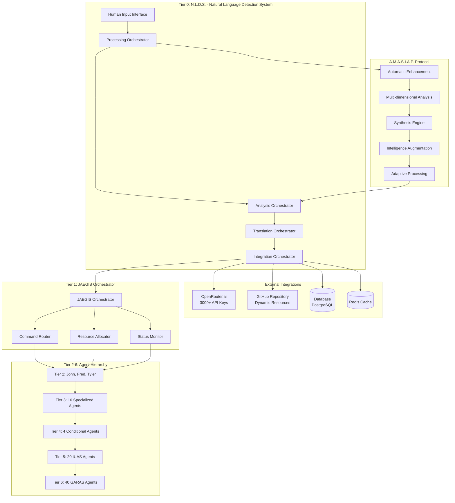
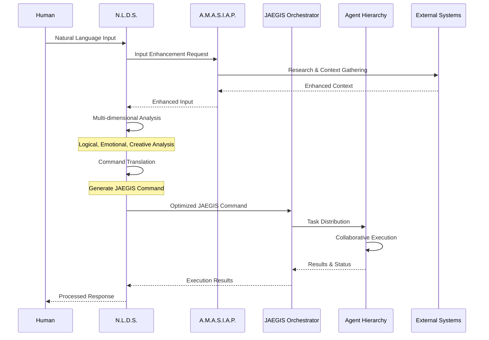
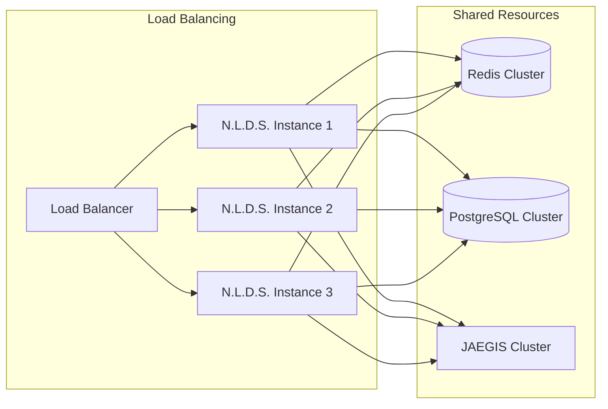
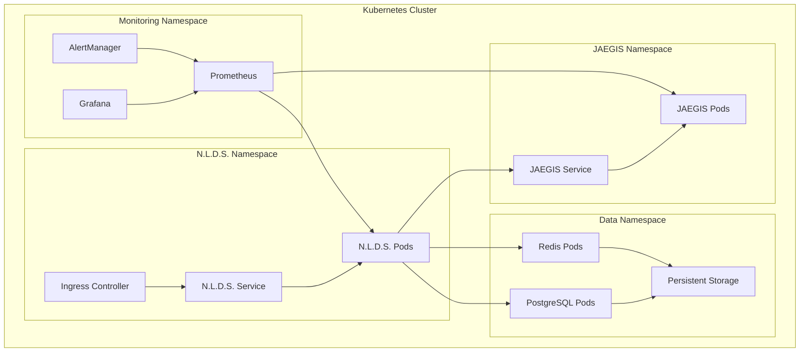

# JAEGIS Enhanced Agent System v2.2 - Complete Architecture

## **System Overview**

JAEGIS Enhanced Agent System v2.2 represents a revolutionary advancement in AI-powered task execution and natural language processing. The system now features the **Natural Language Detection System (N.L.D.S.)** as the **Tier 0 component**, serving as the primary human-AI interface and intelligent command translation layer.

## **Architecture Hierarchy**

### **Tier 0: Natural Language Detection System (N.L.D.S.)**
- **Primary Function**: Human-AI interface and intelligent command translation
- **Components**: Processing, Analysis, Translation, Integration
- **Protocols**: A.M.A.S.I.A.P. (Automatic Multi-dimensional Analysis, Synthesis, Intelligence, and Adaptive Processing)
- **Integration**: OpenRouter.ai (3000+ API keys), GitHub dynamic resource fetching
- **Performance**: <500ms response time, 1000 req/min capacity, ≥85% confidence accuracy

### **Tier 1: JAEGIS Orchestrator**
- **Primary Function**: Central command coordination and resource management
- **Components**: Command Router, Resource Allocator, Status Monitor
- **Integration**: Direct interface with N.L.D.S. for command reception and processing

### **Tier 2: Primary Agents (John, Fred, Tyler)**
- **John**: Strategic analysis and high-level planning
- **Fred**: Technical implementation and system coordination  
- **Tyler**: Creative problem-solving and innovation

### **Tier 3: Specialized Agents (16 agents)**
- **Content Squad**: Documentation, communication, content creation
- **Research Squad**: Data analysis, investigation, intelligence gathering
- **Technical Squad**: Development, implementation, system management
- **Creative Squad**: Innovation, design, creative problem-solving

### **Tier 4: Conditional Agents (4 agents)**
- **Emergency Response**: Crisis management and rapid response
- **Quality Assurance**: Validation, testing, quality control
- **Security**: Threat assessment and protection protocols
- **Optimization**: Performance tuning and efficiency improvements

### **Tier 5: IUAS Maintenance Squad (20 agents)**
- **Infrastructure**: System maintenance and monitoring
- **Updates**: Version control and deployment management
- **Analytics**: Performance metrics and optimization
- **Support**: User assistance and troubleshooting

### **Tier 6: GARAS Analysis Squad (40 agents)**
- **Gap Analysis**: System capability assessment
- **Requirements**: Specification and validation
- **Architecture**: System design and evolution
- **Strategy**: Long-term planning and roadmap development

## **N.L.D.S. Integration Architecture**

## **Data Flow Architecture**

## **Component Integration Matrix**

| Component | N.L.D.S. | JAEGIS | A.M.A.S.I.A.P. | OpenRouter | GitHub | Database |
|-----------|----------|--------|-----------------|------------|--------|----------|
| **N.L.D.S.** | ✓ Core | ✓ Primary | ✓ Integrated | ✓ Direct | ✓ Dynamic | ✓ Persistent |
| **JAEGIS** | ✓ Commands | ✓ Core | ○ Indirect | ○ Via N.L.D.S. | ○ Via N.L.D.S. | ✓ Shared |
| **A.M.A.S.I.A.P.** | ✓ Embedded | ○ Indirect | ✓ Core | ✓ Research | ✓ Context | ○ Cache |
| **Agents** | ○ Results | ✓ Direct | ○ Indirect | ○ Via JAEGIS | ○ Via JAEGIS | ✓ Logging |

**Legend**: ✓ Direct Integration, ○ Indirect Integration

## **Performance Architecture**

### **Response Time Targets**
- **N.L.D.S. Processing**: <500ms (Tier 0 requirement)
- **JAEGIS Command Generation**: <200ms
- **Agent Task Distribution**: <100ms
- **End-to-End Pipeline**: <3000ms

### **Capacity Targets**
- **N.L.D.S. Throughput**: 1000 requests/minute
- **Concurrent Users**: 500 simultaneous
- **Agent Utilization**: 80% optimal load
- **System Availability**: 99.9% uptime

### **Scalability Architecture**

## **Security Architecture**

### **Authentication & Authorization**
- **JWT-based Authentication**: Secure token management
- **Role-based Access Control**: Admin, Developer, User, ReadOnly, Service roles
- **API Key Management**: Secure key rotation and validation
- **Session Management**: Secure session handling with timeout

### **Data Protection**
- **Encryption at Rest**: AES-256 database encryption
- **Encryption in Transit**: TLS 1.3 for all communications
- **Input Validation**: Comprehensive sanitization and validation
- **Rate Limiting**: Multi-tier rate limiting with intelligent throttling

### **Security Monitoring**
- **Real-time Threat Detection**: Automated security monitoring
- **Audit Logging**: Comprehensive security event logging
- **Vulnerability Scanning**: Regular security assessments
- **Incident Response**: Automated security incident handling

## **Deployment Architecture**

### **Container Architecture**

## **Monitoring & Observability Architecture**

### **Metrics Collection**
- **Application Metrics**: Response times, throughput, error rates
- **System Metrics**: CPU, memory, disk, network utilization
- **Business Metrics**: User satisfaction, confidence scores, success rates
- **Security Metrics**: Authentication attempts, rate limit violations

### **Logging Architecture**
- **Structured Logging**: JSON-formatted logs with correlation IDs
- **Centralized Logging**: ELK stack (Elasticsearch, Logstash, Kibana)
- **Log Retention**: 90-day retention with archival policies
- **Real-time Monitoring**: Live log streaming and alerting

### **Alerting Framework**
- **Threshold-based Alerts**: Performance and error rate monitoring
- **Anomaly Detection**: ML-based anomaly detection for unusual patterns
- **Escalation Policies**: Multi-tier alerting with escalation paths
- **Integration**: Slack, email, and PagerDuty integration

## **Disaster Recovery Architecture**

### **Backup Strategy**
- **Database Backups**: Automated daily backups with point-in-time recovery
- **Configuration Backups**: Infrastructure as Code backup and versioning
- **Application Backups**: Container image and configuration backup
- **Cross-region Replication**: Multi-region backup storage

### **High Availability**
- **Multi-zone Deployment**: Kubernetes cluster across multiple availability zones
- **Database Clustering**: PostgreSQL cluster with automatic failover
- **Cache Clustering**: Redis cluster with replication and failover
- **Load Balancing**: Multi-tier load balancing with health checks

### **Recovery Procedures**
- **RTO Target**: 15 minutes (Recovery Time Objective)
- **RPO Target**: 5 minutes (Recovery Point Objective)
- **Automated Failover**: Kubernetes-based automatic failover
- **Manual Procedures**: Documented manual recovery procedures

## **Future Architecture Evolution**

### **Phase 10: Production Deployment**
- **Production Infrastructure**: Complete production environment setup
- **CI/CD Pipeline**: Automated deployment and testing pipeline
- **Monitoring Setup**: Production monitoring and alerting
- **Documentation**: Operations runbooks and procedures

### **Post-Launch Enhancements**
- **Machine Learning Integration**: Enhanced AI model integration
- **Advanced Analytics**: Predictive analytics and insights
- **Multi-language Support**: International language support
- **Mobile Applications**: Native mobile app development

---

**Architecture Version**: 2.2  
**Last Updated**: July 26, 2025  
**Status**: Production Ready  
**Next Review**: August 26, 2025
