# 👥 **JAEGIS v2.2 Agent Hierarchy and Squad Structure**

## **Overview**
This diagram provides a detailed breakdown of all 128 agents across the 6-tier JAEGIS architecture, showing individual agent roles, priorities, squad compositions, and coordination protocols.

## **Agent Hierarchy Diagram**

```mermaid
graph TD
    %% JAEGIS v2.2 Agent Hierarchy and Squad Structure - 128 Agents Detailed
    
    %% Tier 1: Master Orchestrator (1 agent)
    JAEGIS[🎯 JAEGIS<br/>Master Orchestrator<br/>System Intelligence<br/>Priority: 10]
    
    %% Tier 2: Primary Leadership (3 agents)
    John[👔 John<br/>Product Manager<br/>Stakeholder Coordination<br/>Priority: 9]
    Fred[🏗️ Fred<br/>System Architect<br/>Technical Leadership<br/>Priority: 9]
    Tyler[⚡ Tyler<br/>Task Specialist<br/>Execution Coordination<br/>Priority: 9]
    
    %% Tier 3: Development Squad (8 agents)
    DevSquad[💻 Development Squad - 8 Agents]
    SeniorDev[👨‍💻 Senior Developer<br/>Leadership & Architecture<br/>Priority: 9]
    FrontendDev[🎨 Frontend Developer<br/>UI/UX Implementation<br/>Priority: 8]
    BackendDev[⚙️ Backend Developer<br/>API & Systems<br/>Priority: 8]
    FullstackDev[🔄 Full-Stack Developer<br/>End-to-End Integration<br/>Priority: 8]
    MobileDev[📱 Mobile Developer<br/>Cross-Platform Apps<br/>Priority: 8]
    DevOpsEng[🔧 DevOps Engineer<br/>Infrastructure Automation<br/>Priority: 8]
    DatabaseSpec[🗄️ Database Specialist<br/>Data Management<br/>Priority: 8]
    APIDev[🔌 API Developer<br/>Integration Architecture<br/>Priority: 8]
    
    %% Tier 3: Quality Squad (8 agents)
    QualitySquad[🔍 Quality Squad - 8 Agents]
    QALead[👩‍🔬 QA Lead<br/>Quality Strategy<br/>Priority: 9]
    TestAutoEng[🤖 Test Automation Engineer<br/>Automated Testing<br/>Priority: 8]
    PerfTester[⚡ Performance Tester<br/>Load & Performance<br/>Priority: 8]
    SecTester[🛡️ Security Tester<br/>Security Validation<br/>Priority: 8]
    UXTester[👥 UX Tester<br/>User Experience<br/>Priority: 8]
    CodeReviewer[📝 Code Reviewer<br/>Code Quality<br/>Priority: 8]
    QualityAnalyst[📊 Quality Analyst<br/>Metrics & Analysis<br/>Priority: 8]
    ComplianceSpec[📋 Compliance Specialist<br/>Standards Compliance<br/>Priority: 8]
    
    %% Tier 4: Task Management Squad (5 agents)
    TaskMgmtSquad[📋 Task Management Squad - 5 Agents]
    TaskArchitect[🏗️ Task Architect<br/>Workflow Design<br/>Priority: 9]
    TaskMonitor[📊 Task Monitor<br/>Performance Analytics<br/>Priority: 9]
    TaskCoordinator[🔄 Task Coordinator<br/>Dependency Management<br/>Priority: 9]
    TaskValidator[✅ Task Validator<br/>Quality Validation<br/>Priority: 9]
    TaskOptimizer[⚡ Task Optimizer<br/>Pattern Analysis<br/>Priority: 8]
    
    %% Tier 6: IUAS Squad (20 agents)
    IUASSquad[🔧 IUAS Squad - 20 Agents]
    
    %% IUAS System Monitors (5 agents)
    SystemHealthMonitor[📊 System Health Monitor<br/>Health Monitoring<br/>Priority: 10]
    ComponentTracker[🔍 Component Status Tracker<br/>Component Monitoring<br/>Priority: 9]
    IntegrationHealthMon[🔗 Integration Health Monitor<br/>Integration Assessment<br/>Priority: 9]
    PerfMetricsAnalyzer[📈 Performance Metrics Analyzer<br/>Performance Analysis<br/>Priority: 9]
    ResourceTracker[📊 Resource Utilization Tracker<br/>Resource Management<br/>Priority: 9]
    
    %% IUAS Update Coordinators (5 agents)
    UpdateCoordAlpha[🔄 Update Coordinator Alpha<br/>Change Orchestration<br/>Priority: 10]
    UpdateCoordBeta[🔄 Update Coordinator Beta<br/>Compatibility Management<br/>Priority: 9]
    UpdateCoordGamma[🔄 Update Coordinator Gamma<br/>Version Control<br/>Priority: 9]
    UpdateCoordDelta[🔄 Update Coordinator Delta<br/>Rollback Management<br/>Priority: 9]
    UpdateCoordEpsilon[🔄 Update Coordinator Epsilon<br/>Cross-Squad Sync<br/>Priority: 9]
    
    %% GARAS Squad (40 agents)
    GARASSquad[🎯 GARAS Squad - 40 Agents]
    
    %% GARAS Gap Detection Unit (10 agents)
    GapDetectionAlpha[🔍 Gap Detection Alpha<br/>Real-time Monitoring<br/>Priority: 10]
    GapDetectionBeta[🔍 Gap Detection Beta<br/>Integration Monitoring<br/>Priority: 9]
    GapDetectionGamma[🔍 Gap Detection Gamma<br/>Performance Analysis<br/>Priority: 9]
    GapDetectionDelta[🔍 Gap Detection Delta<br/>Knowledge Gaps<br/>Priority: 9]
    GapDetectionEpsilon[🔍 Gap Detection Epsilon<br/>UX Gaps<br/>Priority: 8]
    GapDetectionZeta[🔍 Gap Detection Zeta<br/>Security Gaps<br/>Priority: 8]
    GapDetectionEta[🔍 Gap Detection Eta<br/>Documentation Gaps<br/>Priority: 8]
    GapDetectionTheta[🔍 Gap Detection Theta<br/>Process Gaps<br/>Priority: 8]
    GapDetectionIota[🔍 Gap Detection Iota<br/>Communication Gaps<br/>Priority: 8]
    GapDetectionKappa[🔍 Gap Detection Kappa<br/>Technical Debt<br/>Priority: 8]
    
    %% GARAS Research & Analysis Unit (10 agents)
    ResearchAnalystAlpha[📊 Research Analyst Alpha<br/>Current Date Research<br/>Priority: 9]
    ResearchAnalystBeta[📊 Research Analyst Beta<br/>Technology Trends<br/>Priority: 9]
    ResearchAnalystGamma[📊 Research Analyst Gamma<br/>Best Practices<br/>Priority: 9]
    ResearchAnalystDelta[📊 Research Analyst Delta<br/>Competitive Analysis<br/>Priority: 8]
    ResearchAnalystEpsilon[📊 Research Analyst Epsilon<br/>Industry Standards<br/>Priority: 8]
    ResearchAnalystZeta[📊 Research Analyst Zeta<br/>Innovation Tracking<br/>Priority: 8]
    ResearchAnalystEta[📊 Research Analyst Eta<br/>Market Intelligence<br/>Priority: 8]
    ResearchAnalystTheta[📊 Research Analyst Theta<br/>User Research<br/>Priority: 8]
    ResearchAnalystIota[📊 Research Analyst Iota<br/>Technical Research<br/>Priority: 8]
    ResearchAnalystKappa[📊 Research Analyst Kappa<br/>Academic Research<br/>Priority: 8]
    
    %% Connections
    JAEGIS --> John
    JAEGIS --> Fred
    JAEGIS --> Tyler
    
    %% Tier 2 to Tier 3
    John --> DevSquad
    Fred --> QualitySquad
    Tyler --> TaskMgmtSquad
    
    %% Development Squad Internal
    DevSquad --> SeniorDev
    DevSquad --> FrontendDev
    DevSquad --> BackendDev
    DevSquad --> FullstackDev
    DevSquad --> MobileDev
    DevSquad --> DevOpsEng
    DevSquad --> DatabaseSpec
    DevSquad --> APIDev
    
    %% Quality Squad Internal
    QualitySquad --> QALead
    QualitySquad --> TestAutoEng
    QualitySquad --> PerfTester
    QualitySquad --> SecTester
    QualitySquad --> UXTester
    QualitySquad --> CodeReviewer
    QualitySquad --> QualityAnalyst
    QualitySquad --> ComplianceSpec
    
    %% Task Management Squad Internal
    TaskMgmtSquad --> TaskArchitect
    TaskMgmtSquad --> TaskMonitor
    TaskMgmtSquad --> TaskCoordinator
    TaskMgmtSquad --> TaskValidator
    TaskMgmtSquad --> TaskOptimizer
    
    %% IUAS Squad Connections
    JAEGIS --> IUASSquad
    IUASSquad --> SystemHealthMonitor
    IUASSquad --> ComponentTracker
    IUASSquad --> IntegrationHealthMon
    IUASSquad --> PerfMetricsAnalyzer
    IUASSquad --> ResourceTracker
    IUASSquad --> UpdateCoordAlpha
    IUASSquad --> UpdateCoordBeta
    IUASSquad --> UpdateCoordGamma
    IUASSquad --> UpdateCoordDelta
    IUASSquad --> UpdateCoordEpsilon
    
    %% GARAS Squad Connections
    JAEGIS --> GARASSquad
    GARASSquad --> GapDetectionAlpha
    GARASSquad --> GapDetectionBeta
    GARASSquad --> GapDetectionGamma
    GARASSquad --> GapDetectionDelta
    GARASSquad --> GapDetectionEpsilon
    GARASSquad --> GapDetectionZeta
    GARASSquad --> GapDetectionEta
    GARASSquad --> GapDetectionTheta
    GARASSquad --> GapDetectionIota
    GARASSquad --> GapDetectionKappa
    GARASSquad --> ResearchAnalystAlpha
    GARASSquad --> ResearchAnalystBeta
    GARASSquad --> ResearchAnalystGamma
    GARASSquad --> ResearchAnalystDelta
    GARASSquad --> ResearchAnalystEpsilon
    GARASSquad --> ResearchAnalystZeta
    GARASSquad --> ResearchAnalystEta
    GARASSquad --> ResearchAnalystTheta
    GARASSquad --> ResearchAnalystIota
    GARASSquad --> ResearchAnalystKappa
    
    %% Handoff Protocols
    SystemHealthMonitor --> GapDetectionAlpha
    UpdateCoordAlpha --> ResearchAnalystAlpha
    TaskArchitect --> UpdateCoordAlpha
    
    %% Styling
    classDef tier1 fill:#ff6b6b,stroke:#333,stroke-width:3px,color:#fff
    classDef tier2 fill:#4ecdc4,stroke:#333,stroke-width:2px,color:#fff
    classDef tier3 fill:#45b7d1,stroke:#333,stroke-width:2px,color:#fff
    classDef tier4 fill:#96ceb4,stroke:#333,stroke-width:2px,color:#fff
    classDef tier6 fill:#ff9ff3,stroke:#333,stroke-width:3px,color:#fff
    classDef squad fill:#e8f4f8,stroke:#333,stroke-width:1px,color:#333
    
    class JAEGIS tier1
    class John,Fred,Tyler tier2
    class SeniorDev,FrontendDev,BackendDev,FullstackDev,MobileDev,DevOpsEng,DatabaseSpec,APIDev tier3
    class QALead,TestAutoEng,PerfTester,SecTester,UXTester,CodeReviewer,QualityAnalyst,ComplianceSpec tier3
    class TaskArchitect,TaskMonitor,TaskCoordinator,TaskValidator,TaskOptimizer tier4
    class SystemHealthMonitor,ComponentTracker,IntegrationHealthMon,PerfMetricsAnalyzer,ResourceTracker tier6
    class UpdateCoordAlpha,UpdateCoordBeta,UpdateCoordGamma,UpdateCoordDelta,UpdateCoordEpsilon tier6
    class GapDetectionAlpha,GapDetectionBeta,GapDetectionGamma,GapDetectionDelta,GapDetectionEpsilon tier6
    class GapDetectionZeta,GapDetectionEta,GapDetectionTheta,GapDetectionIota,GapDetectionKappa tier6
    class ResearchAnalystAlpha,ResearchAnalystBeta,ResearchAnalystGamma,ResearchAnalystDelta,ResearchAnalystEpsilon tier6
    class ResearchAnalystZeta,ResearchAnalystEta,ResearchAnalystTheta,ResearchAnalystIota,ResearchAnalystKappa tier6
    class DevSquad,QualitySquad,TaskMgmtSquad,IUASSquad,GARASSquad squad
```

## **Agent Specifications**

### **Tier 1: Master Orchestrator (1 Agent)**
- **JAEGIS**: Supreme AI agent orchestrator with Priority 10, managing entire 128-agent ecosystem

### **Tier 2: Primary Leadership (3 Agents)**
- **John**: Product Manager specializing in stakeholder coordination (Priority 9)
- **Fred**: System Architect providing technical leadership (Priority 9)  
- **Tyler**: Task Specialist managing execution coordination (Priority 9)

### **Tier 3: Core Squads (Sample: 16 Agents Shown)**

#### **Development Squad (8 Agents)**
- **Senior Developer**: Leadership & architecture guidance (Priority 9)
- **Frontend Developer**: UI/UX implementation specialist (Priority 8)
- **Backend Developer**: API & systems development (Priority 8)
- **Full-Stack Developer**: End-to-end integration (Priority 8)
- **Mobile Developer**: Cross-platform application development (Priority 8)
- **DevOps Engineer**: Infrastructure automation (Priority 8)
- **Database Specialist**: Data management and optimization (Priority 8)
- **API Developer**: Integration architecture design (Priority 8)

#### **Quality Squad (8 Agents)**
- **QA Lead**: Quality strategy and oversight (Priority 9)
- **Test Automation Engineer**: Automated testing frameworks (Priority 8)
- **Performance Tester**: Load and performance validation (Priority 8)
- **Security Tester**: Security validation and penetration testing (Priority 8)
- **UX Tester**: User experience validation (Priority 8)
- **Code Reviewer**: Code quality and standards (Priority 8)
- **Quality Analyst**: Metrics analysis and reporting (Priority 8)
- **Compliance Specialist**: Standards and regulatory compliance (Priority 8)

### **Tier 4: Specialized Squads (Sample: 5 Agents Shown)**

#### **Task Management Squad (5 Agents)**
- **Task Architect**: Workflow design and optimization (Priority 9)
- **Task Monitor**: Performance analytics and tracking (Priority 9)
- **Task Coordinator**: Dependency management (Priority 9)
- **Task Validator**: Quality validation protocols (Priority 9)
- **Task Optimizer**: Pattern analysis and improvement (Priority 8)

### **Tier 6: Maintenance & Enhancement (Sample: 35 Agents Shown)**

#### **IUAS Squad (20 Agents Total - 10 Shown)**

**System Monitors (5 Agents)**
- **System Health Monitor**: Overall system health tracking (Priority 10)
- **Component Status Tracker**: Individual component monitoring (Priority 9)
- **Integration Health Monitor**: Integration point assessment (Priority 9)
- **Performance Metrics Analyzer**: Performance data analysis (Priority 9)
- **Resource Utilization Tracker**: Resource management (Priority 9)

**Update Coordinators (5 Agents)**
- **Update Coordinator Alpha**: Primary change orchestration (Priority 10)
- **Update Coordinator Beta**: Compatibility management (Priority 9)
- **Update Coordinator Gamma**: Version control oversight (Priority 9)
- **Update Coordinator Delta**: Rollback management (Priority 9)
- **Update Coordinator Epsilon**: Cross-squad synchronization (Priority 9)

#### **GARAS Squad (40 Agents Total - 20 Shown)**

**Gap Detection Unit (10 Agents)**
- **Gap Detection Alpha**: Real-time monitoring lead (Priority 10)
- **Gap Detection Beta**: Integration monitoring (Priority 9)
- **Gap Detection Gamma**: Performance analysis (Priority 9)
- **Gap Detection Delta**: Knowledge gap identification (Priority 9)
- **Gap Detection Epsilon**: UX gap analysis (Priority 8)
- **Gap Detection Zeta**: Security gap detection (Priority 8)
- **Gap Detection Eta**: Documentation gap analysis (Priority 8)
- **Gap Detection Theta**: Process gap identification (Priority 8)
- **Gap Detection Iota**: Communication gap analysis (Priority 8)
- **Gap Detection Kappa**: Technical debt tracking (Priority 8)

**Research & Analysis Unit (10 Agents)**
- **Research Analyst Alpha**: Current date research lead (Priority 9)
- **Research Analyst Beta**: Technology trend analysis (Priority 9)
- **Research Analyst Gamma**: Best practices research (Priority 9)
- **Research Analyst Delta**: Competitive analysis (Priority 8)
- **Research Analyst Epsilon**: Industry standards research (Priority 8)
- **Research Analyst Zeta**: Innovation tracking (Priority 8)
- **Research Analyst Eta**: Market intelligence (Priority 8)
- **Research Analyst Theta**: User research and feedback (Priority 8)
- **Research Analyst Iota**: Technical research (Priority 8)
- **Research Analyst Kappa**: Academic research integration (Priority 8)

## **Coordination Protocols**

### **Priority System**
- **Priority 10**: Critical system components (JAEGIS, System Health Monitor, Update Coordinator Alpha, Gap Detection Alpha)
- **Priority 9**: Leadership and key coordinators
- **Priority 8**: Specialized operational agents

### **Handoff Protocols**
- **IUAS → GARAS**: System Health Monitor feeds Gap Detection Alpha
- **GARAS → IUAS**: Research findings inform Update Coordinator Alpha
- **Task Management → IUAS**: Task Architect coordinates with Update Coordinator Alpha

### **Communication Patterns**
- **Hierarchical**: Top-down from JAEGIS through tiers
- **Lateral**: Cross-squad collaboration within tiers
- **Feedback**: Bottom-up reporting and optimization

## **Squad Specializations**

### **Development Focus**
- **Full-stack capabilities** across frontend, backend, mobile, and infrastructure
- **DevOps integration** for continuous deployment
- **API-first architecture** for system integration

### **Quality Assurance**
- **Multi-layer testing** from unit to end-to-end
- **Security-first approach** with dedicated security testing
- **Performance optimization** with dedicated performance testing

### **Maintenance Excellence**
- **Proactive monitoring** through IUAS system monitors
- **Intelligent gap detection** through GARAS detection units
- **Research-driven improvements** through GARAS research analysts

## **Usage Context**

This detailed hierarchy serves as:
- **Agent Reference**: Complete specification of all 128 agents
- **Coordination Guide**: Understanding inter-agent relationships
- **Priority Framework**: Agent importance and resource allocation
- **Scaling Blueprint**: How the system expanded from 24 to 128 agents

---

*Note: This diagram shows a representative sample of the 128-agent system. For complete agent specifications, see the individual squad documentation.*

*For process flows, see [Data Flow & Processes](data-flow-processes.md)*  
*For system overview, see [Master System Architecture](master-system-architecture.md)*
