# 🔄 **JAEGIS v2.2 Data Flow and Process Architecture**

## **Overview**
This diagram illustrates the comprehensive data flow and process architecture, including the A.M.A.S.I.A.P. Protocol workflow, GARAS gap detection and resolution processes, IUAS system maintenance, and continuous improvement loops.

## **Data Flow and Process Architecture**

```mermaid
graph TD
    %% JAEGIS v2.2 Data Flow and Process Architecture
    
    %% User Input and A.M.A.S.I.A.P. Protocol
    UserInput[👤 User Input<br/>Original Request<br/>Any Mode]
    
    %% A.M.A.S.I.A.P. Protocol Flow
    AMASIAPTrigger[🔄 A.M.A.S.I.A.P. Protocol<br/>Auto-Trigger Detection<br/>Agent Creator Mode]
    
    %% Input Enhancement Process
    InputAnalysis[🔍 Input Analysis<br/>Request Categorization<br/>Complexity Assessment]
    DateContext[📅 Date Context Update<br/>Current: July 26, 2025<br/>Auto-Update Mechanism]
    
    %% Research Framework
    ResearchFramework[📊 Research Framework<br/>15-20 Targeted Queries<br/>Current Date Context]
    WebResearch[🌐 Web Research Execution<br/>Real-time Data Gathering<br/>Source Attribution]
    DataCatalog[📚 Data Cataloging<br/>Timestamp & Source Tracking<br/>Quality Assessment]
    
    %% Task Hierarchy Generation
    TaskBreakdown[📋 Task Hierarchy Generation<br/>Research → Implementation<br/>Validation → Documentation]
    PhaseGeneration[⚙️ Phase & Sub-Phase Creation<br/>Detailed Task Structure<br/>Dependency Mapping]
    
    %% Implementation Strategy
    ImplementStrategy[🎯 Implementation Strategy<br/>Systematic Execution Plan<br/>Gap Resolution Protocol]
    
    %% Enhanced Request Processing
    EnhancedRequest[✨ Enhanced Request<br/>Original + Research + Tasks<br/>Ready for Execution]
    
    %% JAEGIS System Processing
    JAEGISProcessing[🎯 JAEGIS System Processing<br/>128-Agent Orchestration<br/>6-Tier Architecture]
    
    %% Mode Selection and Squad Activation
    ModeSelection[🎮 Mode Selection<br/>5 Operational Modes<br/>Intelligent Activation]
    SquadActivation[👥 Squad Activation<br/>Context-Based Selection<br/>Cross-Squad Coordination]
    
    %% IUAS System Maintenance Flow
    IUASFlow[🔧 IUAS System Maintenance Flow<br/>20-Agent Maintenance Squad<br/>Continuous Evolution]
    
    %% IUAS Process Steps
    SystemMonitoring[📊 System Monitoring<br/>Real-time Health Tracking<br/>Performance Analytics]
    ChangeDetection[🔍 Change Detection<br/>System Evolution Needs<br/>Update Requirements]
    UpdateCoordination[🔄 Update Coordination<br/>Cross-System Changes<br/>Compatibility Management]
    ChangeImplementation[⚡ Change Implementation<br/>Coordinated Updates<br/>Testing & Validation]
    DocumentationUpdate[📚 Documentation Update<br/>Change Logging<br/>Knowledge Management]
    
    %% GARAS Gap Resolution Flow
    GARASFlow[🎯 GARAS Gap Resolution Flow<br/>40-Agent Gap Resolution<br/>24-Hour Timeline]
    
    %% GARAS Process Steps
    GapDetection[🔍 Gap Detection<br/>Real-time Monitoring<br/>Pattern Recognition]
    GapAnalysis[📊 Gap Analysis<br/>Root Cause Analysis<br/>Impact Assessment]
    ResearchExecution[🌐 Research Execution<br/>15-20 Targeted Queries<br/>Current Date Context]
    SolutionDesign[🎨 Solution Design<br/>Feasibility Assessment<br/>Implementation Planning]
    
    %% Simulation and Testing
    SimulationTesting[🧪 Simulation & Testing<br/>100,000+ Scenarios<br/>Virtual Environment]
    RiskAssessment[⚠️ Risk Assessment<br/>Outcome Prediction<br/>Safety Validation]
    
    %% Implementation and Learning
    GapImplementation[⚡ Gap Implementation<br/>Solution Deployment<br/>Real-time Monitoring]
    MetaLearning[🎓 Meta-Cognitive Learning<br/>Pattern Recognition<br/>System Optimization]
    
    %% Cross-Squad Coordination
    CrossSquadCoord[🔗 Cross-Squad Coordination<br/>Multi-Squad Operations<br/>Intelligent Handoffs]
    
    %% Data Storage and Management
    DataManagement[💾 Data Management<br/>Centralized Storage<br/>Version Control]
    
    %% Knowledge Base
    KnowledgeBase[📚 Knowledge Base<br/>Accumulated Learning<br/>Best Practices]
    PerformanceMetrics[📈 Performance Metrics<br/>Real-time Analytics<br/>Optimization Data]
    AuditTrails[📊 Audit Trails<br/>AES-256 Encryption<br/>Comprehensive Logging]
    
    %% GitHub Integration
    GitHubIntegration[🔗 GitHub Integration<br/>Dynamic Resource Fetching<br/>Automated Sync]
    
    %% OpenRouter.ai Integration
    OpenRouterIntegration[🤖 OpenRouter.ai Integration<br/>3000+ API Keys<br/>Intelligent Load Balancing]
    
    %% Output Generation
    OutputGeneration[📤 Output Generation<br/>Comprehensive Results<br/>Multi-Format Support]
    
    %% Quality Validation
    QualityValidation[✅ Quality Validation<br/>Multi-Layer Verification<br/>Standards Compliance]
    
    %% Final Delivery
    FinalDelivery[🎯 Final Delivery<br/>Complete Solution<br/>Documentation Included]
    
    %% Continuous Improvement Loop
    ContinuousImprovement[🔄 Continuous Improvement<br/>System Evolution<br/>Performance Optimization]
    
    %% Main Flow Connections
    UserInput --> AMASIAPTrigger
    AMASIAPTrigger --> InputAnalysis
    InputAnalysis --> DateContext
    DateContext --> ResearchFramework
    
    %% Research Flow
    ResearchFramework --> WebResearch
    WebResearch --> DataCatalog
    DataCatalog --> TaskBreakdown
    TaskBreakdown --> PhaseGeneration
    PhaseGeneration --> ImplementStrategy
    ImplementStrategy --> EnhancedRequest
    
    %% System Processing
    EnhancedRequest --> JAEGISProcessing
    JAEGISProcessing --> ModeSelection
    ModeSelection --> SquadActivation
    
    %% IUAS Flow
    SquadActivation --> IUASFlow
    IUASFlow --> SystemMonitoring
    SystemMonitoring --> ChangeDetection
    ChangeDetection --> UpdateCoordination
    UpdateCoordination --> ChangeImplementation
    ChangeImplementation --> DocumentationUpdate
    
    %% GARAS Flow
    SquadActivation --> GARASFlow
    GARASFlow --> GapDetection
    GapDetection --> GapAnalysis
    GapAnalysis --> ResearchExecution
    ResearchExecution --> SolutionDesign
    SolutionDesign --> SimulationTesting
    SimulationTesting --> RiskAssessment
    RiskAssessment --> GapImplementation
    GapImplementation --> MetaLearning
    
    %% Cross-Squad Coordination
    IUASFlow --> CrossSquadCoord
    GARASFlow --> CrossSquadCoord
    CrossSquadCoord --> SquadActivation
    
    %% Data Management
    DocumentationUpdate --> DataManagement
    MetaLearning --> DataManagement
    DataManagement --> KnowledgeBase
    DataManagement --> PerformanceMetrics
    DataManagement --> AuditTrails
    
    %% External Integrations
    JAEGISProcessing --> GitHubIntegration
    JAEGISProcessing --> OpenRouterIntegration
    GitHubIntegration --> DataManagement
    OpenRouterIntegration --> SquadActivation
    
    %% Output Processing
    CrossSquadCoord --> OutputGeneration
    OutputGeneration --> QualityValidation
    QualityValidation --> FinalDelivery
    
    %% Continuous Improvement
    FinalDelivery --> ContinuousImprovement
    ContinuousImprovement --> SystemMonitoring
    ContinuousImprovement --> GapDetection
    
    %% Feedback Loops
    PerformanceMetrics -.-> |Performance Data| SystemMonitoring
    AuditTrails -.-> |Audit Data| GapDetection
    KnowledgeBase -.-> |Learning Data| ResearchFramework
    MetaLearning -.-> |Optimization| AMASIAPTrigger
    
    %% Emergency Protocols
    EmergencyProtocol[🚨 Emergency Protocol<br/>Immediate Response<br/>System Protection]
    InfraProtection[🛡️ Infrastructure Protection<br/>Lock/Unlock Mechanism<br/>Security Validation]
    
    %% Emergency Connections
    GapDetection -.-> |Critical Issues| EmergencyProtocol
    SystemMonitoring -.-> |System Threats| InfraProtection
    EmergencyProtocol --> InfraProtection
    InfraProtection --> JAEGISProcessing
    
    %% Real-time Monitoring Dashboard
    MonitoringDashboard[📊 Real-time Monitoring Dashboard<br/>128-Agent Status<br/>Performance Metrics]
    
    %% Dashboard Connections
    SystemMonitoring --> MonitoringDashboard
    GapDetection --> MonitoringDashboard
    CrossSquadCoord --> MonitoringDashboard
    PerformanceMetrics --> MonitoringDashboard
    
    %% Styling
    classDef input fill:#e1f5fe,stroke:#0277bd,stroke-width:2px,color:#000
    classDef amasiap fill:#f3e5f5,stroke:#7b1fa2,stroke-width:2px,color:#000
    classDef research fill:#e8f5e8,stroke:#2e7d32,stroke-width:2px,color:#000
    classDef iuas fill:#fff3e0,stroke:#ef6c00,stroke-width:2px,color:#000
    classDef garas fill:#fce4ec,stroke:#c2185b,stroke-width:2px,color:#000
    classDef system fill:#e3f2fd,stroke:#1565c0,stroke-width:2px,color:#000
    classDef data fill:#f1f8e9,stroke:#558b2f,stroke-width:2px,color:#000
    classDef security fill:#ffebee,stroke:#d32f2f,stroke-width:2px,color:#000
    classDef output fill:#f9fbe7,stroke:#827717,stroke-width:2px,color:#000
    classDef emergency fill:#ff5722,stroke:#333,stroke-width:3px,color:#fff
    classDef monitoring fill:#37474f,stroke:#333,stroke-width:2px,color:#fff
    
    class UserInput,InputAnalysis,DateContext input
    class AMASIAPTrigger,ResearchFramework,WebResearch,DataCatalog,TaskBreakdown,PhaseGeneration,ImplementStrategy,EnhancedRequest amasiap
    class ResearchExecution research
    class IUASFlow,SystemMonitoring,ChangeDetection,UpdateCoordination,ChangeImplementation,DocumentationUpdate iuas
    class GARASFlow,GapDetection,GapAnalysis,SolutionDesign,SimulationTesting,RiskAssessment,GapImplementation,MetaLearning garas
    class JAEGISProcessing,ModeSelection,SquadActivation,CrossSquadCoord,GitHubIntegration,OpenRouterIntegration system
    class DataManagement,KnowledgeBase,PerformanceMetrics,AuditTrails data
    class InfraProtection security
    class OutputGeneration,QualityValidation,FinalDelivery,ContinuousImprovement output
    class EmergencyProtocol emergency
    class MonitoringDashboard monitoring
```

## **Process Workflows**

### **A.M.A.S.I.A.P. Protocol Workflow**

#### **Phase 1: Input Enhancement**
1. **User Input**: Original request received
2. **Auto-Trigger Detection**: Protocol activation in Agent Creator Mode
3. **Input Analysis**: Request categorization and complexity assessment
4. **Date Context Update**: Current date integration (July 26, 2025)

#### **Phase 2: Research Framework**
1. **Research Framework**: 15-20 targeted queries generation
2. **Web Research Execution**: Real-time data gathering with source attribution
3. **Data Cataloging**: Timestamp and source tracking with quality assessment

#### **Phase 3: Task Generation**
1. **Task Hierarchy Generation**: Research → Implementation → Validation → Documentation
2. **Phase & Sub-Phase Creation**: Detailed task structure with dependency mapping
3. **Implementation Strategy**: Systematic execution plan with gap resolution protocol
4. **Enhanced Request**: Original + Research + Tasks ready for execution

### **IUAS System Maintenance Workflow**

#### **Continuous Monitoring (20 Agents)**
1. **System Monitoring**: Real-time health tracking and performance analytics
2. **Change Detection**: System evolution needs and update requirements identification
3. **Update Coordination**: Cross-system changes with compatibility management
4. **Change Implementation**: Coordinated updates with testing and validation
5. **Documentation Update**: Change logging and knowledge management

#### **Maintenance Units**
- **System Monitors (5 agents)**: Health, performance, integration, resource tracking
- **Update Coordinators (5 agents)**: Change orchestration and compatibility
- **Change Implementers (5 agents)**: Update execution and validation
- **Documentation Specialists (5 agents)**: Change logging and knowledge management

### **GARAS Gap Resolution Workflow**

#### **24-Hour Resolution Timeline (40 Agents)**
1. **Gap Detection**: Real-time monitoring with pattern recognition
2. **Gap Analysis**: Root cause analysis and impact assessment
3. **Research Execution**: 15-20 targeted queries with current date context
4. **Solution Design**: Feasibility assessment and implementation planning
5. **Simulation & Testing**: 100,000+ scenarios in virtual environment
6. **Risk Assessment**: Outcome prediction and safety validation
7. **Gap Implementation**: Solution deployment with real-time monitoring
8. **Meta-Cognitive Learning**: Pattern recognition and system optimization

#### **GARAS Sub-Squads**
- **Gap Detection Unit (10 agents)**: Real-time monitoring and pattern recognition
- **Research & Analysis Unit (10 agents)**: Current date research and analysis
- **Simulation & Testing Unit (10 agents)**: High-speed simulation capabilities
- **Implementation & Learning Unit (10 agents)**: Gap resolution and meta-learning

## **Data Management Architecture**

### **Centralized Storage System**
- **Data Management**: Centralized storage with version control
- **Knowledge Base**: Accumulated learning and best practices
- **Performance Metrics**: Real-time analytics and optimization data
- **Audit Trails**: AES-256 encryption with comprehensive logging

### **Integration Points**
- **GitHub Integration**: Dynamic resource fetching and automated sync
- **OpenRouter.ai Integration**: 3000+ API keys with intelligent load balancing
- **Cross-System Data Flow**: Seamless data exchange between components

## **Quality Assurance Pipeline**

### **Multi-Layer Validation**
1. **Output Generation**: Comprehensive results with multi-format support
2. **Quality Validation**: Multi-layer verification and standards compliance
3. **Final Delivery**: Complete solution with documentation included
4. **Continuous Improvement**: System evolution and performance optimization

### **Feedback Loops**
- **Performance Data**: Performance metrics feed system monitoring
- **Audit Data**: Audit trails inform gap detection
- **Learning Data**: Knowledge base enhances research framework
- **Optimization**: Meta-learning improves A.M.A.S.I.A.P. Protocol

## **Emergency and Security Protocols**

### **Emergency Response**
- **Emergency Protocol**: Immediate response and system protection
- **Infrastructure Protection**: Lock/unlock mechanism with security validation
- **Critical Issue Escalation**: Gap detection triggers emergency protocols
- **System Threat Response**: Monitoring triggers infrastructure protection

### **Real-Time Monitoring**
- **Monitoring Dashboard**: 128-agent status and performance metrics
- **System Health**: Continuous monitoring integration
- **Gap Detection**: Real-time gap analysis
- **Cross-Squad Coordination**: Multi-squad operation tracking

## **Performance Optimization**

### **Continuous Improvement Cycle**
1. **Performance Analysis**: Real-time metrics collection
2. **Gap Identification**: Automated gap detection
3. **Research & Development**: Evidence-based improvements
4. **Implementation**: Coordinated system updates
5. **Validation**: Performance verification
6. **Learning Integration**: Knowledge base updates

### **Optimization Targets**
- **Response Time**: Faster processing and delivery
- **Resource Efficiency**: Optimized agent utilization
- **Quality Enhancement**: Improved output quality
- **System Reliability**: Enhanced stability and uptime

## **Cross-Squad Coordination**

### **Intelligent Handoffs**
- **Context Preservation**: Seamless information transfer
- **Dependency Management**: Automated dependency resolution
- **Priority Coordination**: Intelligent task prioritization
- **Resource Optimization**: Efficient resource allocation

### **Multi-Squad Operations**
- **Parallel Processing**: Concurrent squad operations
- **Synchronization Points**: Coordinated checkpoints
- **Conflict Resolution**: Automated conflict management
- **Performance Tracking**: Multi-squad performance analytics

## **Usage Context**

This data flow and process architecture enables:
- **Intelligent Enhancement**: Automatic input improvement through A.M.A.S.I.A.P.
- **Proactive Maintenance**: Continuous system evolution through IUAS
- **Rapid Gap Resolution**: 24-hour gap resolution through GARAS
- **Quality Assurance**: Multi-layer validation and continuous improvement
- **Emergency Response**: Comprehensive emergency and security protocols

---

*For system architecture, see [Master System Architecture](master-system-architecture.md)*  
*For security details, see [Security Framework](security-protection-framework.md)*
