# 🔗 **JAEGIS v2.2 GitHub Integration and Resource Flow**

## **Overview**
This diagram illustrates the dynamic resource fetching architecture, GitHub repository structure, automated sync protocols, and the relationship between local workspace and remote repository resources.

## **GitHub Integration Architecture**

```mermaid
graph TB
    %% JAEGIS v2.2 GitHub Integration and Resource Flow Architecture
    
    %% GitHub Repository Structure
    GitHubRepo[🔗 GitHub Repository<br/>usemanusai/JAEGIS<br/>Main Branch]
    
    %% Core Directory Structure
    CoreDir[📁 core/<br/>Agent Configurations]
    CommandsDir[📁 commands/<br/>Command Systems]
    ConfigDir[📁 config/<br/>System Configurations]
    DocsDir[📁 docs/<br/>Documentation & Diagrams]
    
    %% Core Configuration Files
    AgentConfig[📄 agent-config.txt<br/>24-Agent Standard System<br/>4-Tier Architecture]
    EnhancedConfig[📄 enhanced-agent-config.txt<br/>68-Agent Enhanced System<br/>5-Tier Squad Architecture]
    IUASConfig[📄 iuas-agent-config.txt<br/>20-Agent IUAS Squad<br/>Tier 6 Maintenance]
    GARASConfig[📄 garas-agent-config.txt<br/>40-Agent GARAS Squad<br/>Tier 6 Gap Resolution]
    
    %% Command System Files
    StandardCommands[📄 commands.md<br/>Standard Command Set<br/>Basic Operations]
    SquadCommands[📄 squad-commands.md<br/>Enhanced Squad Commands<br/>100+ Commands]
    EnhancedCommands[📄 enhanced-squad-commands.md<br/>Phase 5 Commands<br/>150+ Commands]
    
    %% Configuration Files
    OpenRouterConfig[📄 openrouter-config.json<br/>Enhanced OpenRouter.ai<br/>3000+ API Keys]
    SyncConfig[📄 sync-config.json<br/>GitHub Sync Configuration<br/>60-min Cycles]
    
    %% Documentation Files
    README[📄 README.md<br/>Professional Documentation<br/>Enterprise Presentation]
    Contributing[📄 CONTRIBUTING.md<br/>Community Guidelines<br/>Development Standards]
    Changelog[📄 CHANGELOG.md<br/>Version History<br/>Release Notes]
    
    %% Local Workspace
    LocalWorkspace[💻 Local Workspace<br/>JAEGIS v2.2<br/>128-Agent System]
    
    %% Dynamic Resource Fetching System
    ResourceFetcher[🔄 Dynamic Resource Fetcher<br/>Real-time Configuration Loading<br/>Mode-based Activation]
    
    %% Mode Selection System
    ModeSelector[🎯 Mode Selection System<br/>5 Operational Modes<br/>Intelligent Activation]
    
    %% Operational Modes
    DocMode[📋 Documentation Mode<br/>3-Agent Team<br/>John, Fred, Tyler]
    StandardMode[🚀 Standard Development Mode<br/>24-Agent System<br/>4-Tier Architecture]
    EnhancedMode[🎯 Enhanced Development Mode<br/>68-Agent System<br/>5-Tier Squads]
    AISystemMode[🤖 AI System Mode<br/>GitHub-Hosted AI<br/>Enhanced OpenRouter]
    AgentCreatorMode[🔧 Agent Creator Mode<br/>128-Agent System<br/>6-Tier with Maintenance]
    
    %% Automated Sync System
    AutoSync[🔄 Automated GitHub Sync<br/>60-minute Cycles<br/>Security Protocols]
    
    %% Security Components
    PreSyncScan[🛡️ Pre-Sync Security Scan<br/>Vulnerability Detection<br/>Sensitive Data Check]
    DataSanitization[🧹 Data Sanitization<br/>Example Data Replacement<br/>Mock Data Generation]
    AuditTrail[📊 Audit Trail System<br/>AES-256 Encryption<br/>Comprehensive Logging]
    
    %% Branch Strategy
    MainBranch[🌿 main<br/>Production Branch<br/>Protected]
    DevBranch[🌿 development<br/>Development Branch<br/>Sync Target]
    StagingBranch[🌿 staging<br/>Staging Branch<br/>Sync Target]
    FeatureBranches[🌿 feature/*<br/>Feature Branches<br/>Sync Target]
    
    %% Documentation Generation
    ReadmeGen[📚 README.md Generator<br/>Professional Documentation<br/>Auto-update]
    MermaidGen[📊 Mermaid Diagram Generator<br/>System Architecture<br/>Strategic Visualization]
    MetadataOpt[🏷️ Metadata Optimization<br/>SEO Keywords<br/>Intelligent Classification]
    
    %% A.M.A.S.I.A.P. Protocol Integration
    AMASIAPProtocol[🔄 A.M.A.S.I.A.P. Protocol<br/>Auto Input Enhancement<br/>15-20 Research Queries]
    
    %% Infrastructure Protection
    InfraProtection[🛡️ Infrastructure Protection<br/>Lock/Unlock Commands<br/>Audit Capabilities]
    
    %% URL Mapping (Dynamic Resource Fetching)
    URLMapping[🔗 URL Mapping<br/>Dynamic Resource URLs]
    
    %% Specific URLs
    URL1[https://raw.githubusercontent.com/<br/>usemanusai/JAEGIS/main/<br/>core/agent-config.txt]
    URL2[https://raw.githubusercontent.com/<br/>usemanusai/JAEGIS/main/<br/>core/enhanced-agent-config.txt]
    URL3[https://raw.githubusercontent.com/<br/>usemanusai/JAEGIS/main/<br/>core/iuas-agent-config.txt]
    URL4[https://raw.githubusercontent.com/<br/>usemanusai/JAEGIS/main/<br/>core/garas-agent-config.txt]
    URL5[https://raw.githubusercontent.com/<br/>usemanusai/JAEGIS/main/<br/>commands/enhanced-squad-commands.md]
    URL6[https://raw.githubusercontent.com/<br/>usemanusai/JAEGIS/main/<br/>config/openrouter-config.json]
    URL7[https://raw.githubusercontent.com/<br/>usemanusai/JAEGIS/main/<br/>config/sync-config.json]
    
    %% Connections - Repository Structure
    GitHubRepo --> CoreDir
    GitHubRepo --> CommandsDir
    GitHubRepo --> ConfigDir
    GitHubRepo --> DocsDir
    
    %% Core Directory Files
    CoreDir --> AgentConfig
    CoreDir --> EnhancedConfig
    CoreDir --> IUASConfig
    CoreDir --> GARASConfig
    
    %% Commands Directory Files
    CommandsDir --> StandardCommands
    CommandsDir --> SquadCommands
    CommandsDir --> EnhancedCommands
    
    %% Config Directory Files
    ConfigDir --> OpenRouterConfig
    ConfigDir --> SyncConfig
    
    %% Documentation Files
    DocsDir --> README
    DocsDir --> Contributing
    DocsDir --> Changelog
    
    %% Dynamic Resource Fetching Flow
    LocalWorkspace --> ResourceFetcher
    ResourceFetcher --> GitHubRepo
    ResourceFetcher --> ModeSelector
    
    %% Mode-based Resource Loading
    ModeSelector --> DocMode
    ModeSelector --> StandardMode
    ModeSelector --> EnhancedMode
    ModeSelector --> AISystemMode
    ModeSelector --> AgentCreatorMode
    
    %% Mode-specific Resource Mapping
    DocMode --> AgentConfig
    StandardMode --> AgentConfig
    StandardMode --> StandardCommands
    
    EnhancedMode --> EnhancedConfig
    EnhancedMode --> SquadCommands
    
    AISystemMode --> OpenRouterConfig
    
    AgentCreatorMode --> IUASConfig
    AgentCreatorMode --> GARASConfig
    AgentCreatorMode --> EnhancedCommands
    AgentCreatorMode --> OpenRouterConfig
    AgentCreatorMode --> SyncConfig
    
    %% Automated Sync Flow
    LocalWorkspace --> AutoSync
    AutoSync --> PreSyncScan
    PreSyncScan --> DataSanitization
    DataSanitization --> AuditTrail
    
    %% Branch Strategy Flow
    AutoSync --> DevBranch
    AutoSync --> StagingBranch
    AutoSync --> FeatureBranches
    MainBranch -.-> |Protected| AutoSync
    
    %% Documentation Generation Flow
    AutoSync --> ReadmeGen
    AutoSync --> MermaidGen
    AutoSync --> MetadataOpt
    
    %% Protocol Integration
    AgentCreatorMode --> AMASIAPProtocol
    AMASIAPProtocol --> ResourceFetcher
    
    %% Security Integration
    LocalWorkspace --> InfraProtection
    InfraProtection --> AuditTrail
    
    %% URL Connections
    ResourceFetcher --> URLMapping
    URLMapping --> URL1
    URLMapping --> URL2
    URLMapping --> URL3
    URLMapping --> URL4
    URLMapping --> URL5
    URLMapping --> URL6
    URLMapping --> URL7
    
    %% Styling
    classDef github fill:#24292e,stroke:#333,stroke-width:2px,color:#fff
    classDef directory fill:#0366d6,stroke:#333,stroke-width:2px,color:#fff
    classDef config fill:#28a745,stroke:#333,stroke-width:2px,color:#fff
    classDef command fill:#6f42c1,stroke:#333,stroke-width:2px,color:#fff
    classDef mode fill:#fd7e14,stroke:#333,stroke-width:2px,color:#fff
    classDef security fill:#dc3545,stroke:#333,stroke-width:2px,color:#fff
    classDef sync fill:#17a2b8,stroke:#333,stroke-width:2px,color:#fff
    classDef url fill:#6c757d,stroke:#333,stroke-width:1px,color:#fff
    classDef branch fill:#198754,stroke:#333,stroke-width:2px,color:#fff
    classDef docs fill:#e83e8c,stroke:#333,stroke-width:2px,color:#fff
    
    class GitHubRepo github
    class CoreDir,CommandsDir,ConfigDir,DocsDir directory
    class AgentConfig,EnhancedConfig,IUASConfig,GARASConfig,OpenRouterConfig,SyncConfig config
    class StandardCommands,SquadCommands,EnhancedCommands command
    class DocMode,StandardMode,EnhancedMode,AISystemMode,AgentCreatorMode mode
    class PreSyncScan,DataSanitization,AuditTrail,InfraProtection security
    class AutoSync,ResourceFetcher,AMASIAPProtocol sync
    class URL1,URL2,URL3,URL4,URL5,URL6,URL7,URLMapping url
    class MainBranch,DevBranch,StagingBranch,FeatureBranches branch
    class ReadmeGen,MermaidGen,MetadataOpt,README,Contributing,Changelog docs
```



## **Key Components**

### **GitHub Repository Structure**
```
usemanusai/JAEGIS/
├── core/
│   ├── agent-config.txt (24-agent standard)
│   ├── enhanced-agent-config.txt (68-agent enhanced)
│   ├── iuas-agent-config.txt (20-agent IUAS)
│   └── garas-agent-config.txt (40-agent GARAS)
├── commands/
│   ├── commands.md (standard commands)
│   ├── squad-commands.md (100+ commands)
│   └── enhanced-squad-commands.md (150+ commands)
├── config/
│   ├── openrouter-config.json (3000+ API keys)
│   └── sync-config.json (60-min cycles)
└── docs/
    ├── README.md (professional documentation)
    ├── CONTRIBUTING.md (community guidelines)
    └── CHANGELOG.md (version history)
```

### **Dynamic Resource Fetching URLs**
1. **Agent Configurations**:
   - `https://raw.githubusercontent.com/usemanusai/JAEGIS/main/core/agent-config.txt`
   - `https://raw.githubusercontent.com/usemanusai/JAEGIS/main/core/enhanced-agent-config.txt`
   - `https://raw.githubusercontent.com/usemanusai/JAEGIS/main/core/iuas-agent-config.txt`
   - `https://raw.githubusercontent.com/usemanusai/JAEGIS/main/core/garas-agent-config.txt`

2. **Command Systems**:
   - `https://raw.githubusercontent.com/usemanusai/JAEGIS/main/commands/enhanced-squad-commands.md`

3. **Configuration Files**:
   - `https://raw.githubusercontent.com/usemanusai/JAEGIS/main/config/openrouter-config.json`
   - `https://raw.githubusercontent.com/usemanusai/JAEGIS/main/config/sync-config.json`

## **Operational Modes and Resource Mapping**

### **Mode 1: Documentation Mode**
- **Agents**: 3 (John, Fred, Tyler)
- **Resources**: `agent-config.txt`
- **Use Case**: Simple documentation tasks

### **Mode 2: Standard Development Mode**
- **Agents**: 24 (4-tier architecture)
- **Resources**: `agent-config.txt`, `commands.md`
- **Use Case**: Traditional development projects

### **Mode 3: Enhanced Development Mode**
- **Agents**: 68 (5-tier squad architecture)
- **Resources**: `enhanced-agent-config.txt`, `squad-commands.md`
- **Use Case**: Complex multi-squad operations

### **Mode 4: AI System Mode**
- **Agents**: Variable (GitHub-hosted components)
- **Resources**: `openrouter-config.json`
- **Use Case**: Enhanced AI integration

### **Mode 5: Agent Creator Mode**
- **Agents**: 128 (6-tier with maintenance)
- **Resources**: All configuration files
- **Use Case**: Full system orchestration

## **Automated Sync System**

### **Sync Cycle (60 Minutes)**
1. **Pre-Sync Security Scan**: Vulnerability detection and sensitive data checking
2. **Data Sanitization**: Automatic replacement with example data
3. **Branch Targeting**: Development, staging, and feature branches (excludes main)
4. **Audit Trail**: Comprehensive logging with AES-256 encryption

### **Security Protocols**
- **Sensitive File Detection**: Automatic identification of credentials and secrets
- **Data Replacement**: Safe example data substitution
- **Vulnerability Scanning**: Pre-deployment security checks
- **Audit Logging**: Complete change tracking

## **Branch Strategy**

### **Protected Branches**
- **main**: Production branch (protected from automated sync)

### **Sync Target Branches**
- **development**: Primary development branch
- **staging**: Pre-production testing
- **feature/***: Feature development branches

### **Sync Exclusions**
- **main branch**: Manual merge only
- **release branches**: Controlled release process
- **hotfix branches**: Emergency fix process

## **Documentation Generation**

### **Automated Documentation**
- **README.md Generator**: Professional repository presentation
- **Mermaid Diagram Generator**: System architecture visualization
- **Metadata Optimization**: SEO and discoverability enhancement

### **Content Management**
- **Version Control**: All documentation version controlled
- **Cross-References**: Automatic link generation
- **Template System**: Consistent formatting and structure

## **A.M.A.S.I.A.P. Protocol Integration**

### **Automatic Enhancement**
- **Input Analysis**: Request categorization and complexity assessment
- **Research Framework**: 15-20 targeted queries with current date context
- **Task Generation**: Systematic breakdown and implementation planning

### **GitHub Integration**
- **Resource Fetching**: Dynamic loading based on enhancement requirements
- **Documentation Updates**: Automatic documentation generation
- **Quality Assurance**: Validation and testing protocols

## **Infrastructure Protection**

### **Lock/Unlock Mechanism**
- **Infrastructure Lock**: Prevents architectural changes
- **Audit Capabilities**: Comprehensive change tracking
- **Security Validation**: Multi-layer protection protocols

### **Access Control**
- **Role-Based Permissions**: Granular access control
- **Command Authorization**: Pre-execution validation
- **Audit Trail**: Complete action logging

## **Performance Optimization**

### **Caching Strategy**
- **Resource Caching**: Local caching of frequently accessed resources
- **Intelligent Refresh**: Smart cache invalidation
- **Bandwidth Optimization**: Efficient data transfer

### **Load Balancing**
- **Request Distribution**: Intelligent request routing
- **Failover Mechanisms**: Automatic fallback systems
- **Performance Monitoring**: Real-time performance tracking

## **Usage Context**

This GitHub integration architecture enables:
- **Dynamic Configuration**: Real-time resource loading
- **Automated Deployment**: Secure, automated sync processes
- **Version Control**: Complete change tracking and rollback
- **Security Compliance**: Enterprise-grade protection protocols
- **Documentation Management**: Automated documentation generation

---

*For security details, see [Security Framework](security-protection-framework.md)*  
*For command system details, see [Command System Architecture](command-system-architecture.md)*
