# 🎯 **JAEGIS v2.2 Master System Architecture**

## **Overview**
This diagram provides a complete overview of the JAEGIS Enhanced Agent System v2.2, showcasing the 6-tier architecture with 128 agents, all integration points, and coordination protocols.

## **Architecture Diagram**

```mermaid
graph TB
    %% JAEGIS v2.2 Master System Architecture - 128-Agent 6-Tier System
    
    %% External Integrations
    GitHub[🔗 GitHub Repository<br/>usemanusai/JAEGIS<br/>Dynamic Resource Fetching]
    OpenRouter[🤖 OpenRouter.ai<br/>3000+ API Keys<br/>15M Daily Messages]
    AMASIAP[🔄 A.M.A.S.I.A.P. Protocol<br/>Auto Input Enhancement<br/>15-20 Research Queries]
    
    %% Tier 1: Master Orchestrator
    JAEGIS[🎯 JAEGIS<br/>Master Orchestrator<br/>System Intelligence]
    
    %% Tier 2: Primary Leadership
    John[👔 John<br/>Product Manager<br/>Stakeholder Coordination]
    Fred[🏗️ Fred<br/>System Architect<br/>Technical Leadership]
    Tyler[⚡ Tyler<br/>Task Specialist<br/>Execution Coordination]
    
    %% Tier 3: Core Squads (48 agents)
    DevSquad[💻 Development Squad<br/>8 Agents<br/>Senior, Frontend, Backend, etc.]
    QualitySquad[🔍 Quality Squad<br/>8 Agents<br/>QA Lead, Automation, etc.]
    BusinessSquad[📊 Business Squad<br/>8 Agents<br/>Analyst, Research, etc.]
    ProcessSquad[⚙️ Process Squad<br/>8 Agents<br/>Project Manager, Scrum, etc.]
    ContentSquad[📝 Content Squad<br/>8 Agents<br/>Strategy, Technical Writer, etc.]
    SystemSquad[🖥️ System Squad<br/>8 Agents<br/>Admin, Network, Security, etc.]
    
    %% Tier 4: Specialized Squads (16 agents)
    TaskMgmt[📋 Task Management Squad<br/>5 Agents<br/>Architect, Monitor, etc.]
    AgentBuilder[🔧 Agent Builder Squad<br/>4 Agents<br/>Research, Generation, etc.]
    SystemCoherence[🔗 System Coherence Squad<br/>3 Agents<br/>Monitor, Validator, etc.]
    TemporalIntel[⏰ Temporal Intelligence Squad<br/>4 Agents<br/>Enforcer, Validator, etc.]
    
    %% Tier 5: Conditional & Core System (5 agents)
    WebCreator[🌐 WebCreator<br/>Web Development]
    IDEDev[💾 IDEDev<br/>IDE Development]
    DevOpsIDE[🔄 DevOpsIDE<br/>DevOps Integration]
    AdvancedIDE[⚡ AdvancedIDE<br/>Advanced Development]
    ConfigMgr[⚙️ Configuration Manager<br/>System Optimization]
    
    %% Tier 6: Maintenance & Enhancement (60 agents) - NEW
    IUAS[🔧 IUAS Squad<br/>20 Agents<br/>Internal Updates & Maintenance]
    GARAS[🎯 GARAS Squad<br/>40 Agents<br/>Gap Analysis & Resolution]
    
    %% IUAS Sub-Units
    SystemMonitors[📊 System Monitors<br/>5 Agents<br/>Health, Performance, etc.]
    UpdateCoords[🔄 Update Coordinators<br/>5 Agents<br/>Change Orchestration]
    ChangeImpl[⚡ Change Implementers<br/>5 Agents<br/>Update Execution]
    DocSpecs[📚 Documentation Specialists<br/>5 Agents<br/>Change Logging]
    
    %% GARAS Sub-Squads
    GapDetection[🔍 Gap Detection Unit<br/>10 Agents<br/>Real-time Monitoring]
    ResearchAnalysis[📊 Research & Analysis Unit<br/>10 Agents<br/>Current Date Research]
    SimTesting[🧪 Simulation & Testing Unit<br/>10 Agents<br/>100K+ Scenarios]
    ImplLearning[🎓 Implementation & Learning Unit<br/>10 Agents<br/>Meta-cognitive Learning]
    
    %% Security & Protection
    InfraProt[🛡️ Infrastructure Protection<br/>Lock/Unlock Commands<br/>Audit Trails]
    GitHubSync[🔄 GitHub Sync System<br/>60-min Cycles<br/>Security Protocols]
    
    %% Command System
    Commands[📋 Command System<br/>150+ Commands<br/>5 Operational Modes]
    
    %% Connections - External Integrations
    GitHub --> JAEGIS
    OpenRouter --> JAEGIS
    AMASIAP --> JAEGIS
    
    %% Tier 1 to Tier 2
    JAEGIS --> John
    JAEGIS --> Fred
    JAEGIS --> Tyler
    
    %% Tier 2 to Tier 3
    John --> DevSquad
    John --> BusinessSquad
    Fred --> DevSquad
    Fred --> SystemSquad
    Tyler --> ProcessSquad
    Tyler --> TaskMgmt
    
    %% Tier 3 Core Squads
    DevSquad --> QualitySquad
    QualitySquad --> BusinessSquad
    BusinessSquad --> ProcessSquad
    ProcessSquad --> ContentSquad
    ContentSquad --> SystemSquad
    
    %% Tier 3 to Tier 4
    DevSquad --> AgentBuilder
    QualitySquad --> SystemCoherence
    ProcessSquad --> TaskMgmt
    SystemSquad --> TemporalIntel
    
    %% Tier 4 to Tier 5
    TaskMgmt --> ConfigMgr
    AgentBuilder --> WebCreator
    AgentBuilder --> IDEDev
    SystemCoherence --> DevOpsIDE
    TemporalIntel --> AdvancedIDE
    
    %% Tier 5 to Tier 6 (NEW)
    ConfigMgr --> IUAS
    ConfigMgr --> GARAS
    
    %% IUAS Internal Structure
    IUAS --> SystemMonitors
    IUAS --> UpdateCoords
    IUAS --> ChangeImpl
    IUAS --> DocSpecs
    
    %% GARAS Internal Structure
    GARAS --> GapDetection
    GARAS --> ResearchAnalysis
    GARAS --> SimTesting
    GARAS --> ImplLearning
    
    %% Cross-Squad Coordination
    SystemMonitors --> GapDetection
    UpdateCoords --> ResearchAnalysis
    ChangeImpl --> SimTesting
    DocSpecs --> ImplLearning
    
    %% Security Integration
    InfraProt --> JAEGIS
    GitHubSync --> GitHub
    GitHubSync --> IUAS
    
    %% Command System Integration
    Commands --> JAEGIS
    Commands --> InfraProt
    
    %% Styling
    classDef tier1 fill:#ff6b6b,stroke:#333,stroke-width:3px,color:#fff
    classDef tier2 fill:#4ecdc4,stroke:#333,stroke-width:2px,color:#fff
    classDef tier3 fill:#45b7d1,stroke:#333,stroke-width:2px,color:#fff
    classDef tier4 fill:#96ceb4,stroke:#333,stroke-width:2px,color:#fff
    classDef tier5 fill:#feca57,stroke:#333,stroke-width:2px,color:#fff
    classDef tier6 fill:#ff9ff3,stroke:#333,stroke-width:3px,color:#fff
    classDef external fill:#dda0dd,stroke:#333,stroke-width:2px,color:#fff
    classDef security fill:#ff6b35,stroke:#333,stroke-width:2px,color:#fff
    
    class JAEGIS tier1
    class John,Fred,Tyler tier2
    class DevSquad,QualitySquad,BusinessSquad,ProcessSquad,ContentSquad,SystemSquad tier3
    class TaskMgmt,AgentBuilder,SystemCoherence,TemporalIntel tier4
    class WebCreator,IDEDev,DevOpsIDE,AdvancedIDE,ConfigMgr tier5
    class IUAS,GARAS,SystemMonitors,UpdateCoords,ChangeImpl,DocSpecs,GapDetection,ResearchAnalysis,SimTesting,ImplLearning tier6
    class GitHub,OpenRouter,AMASIAP external
    class InfraProt,GitHubSync,Commands security
```

## **Key Components**

### **Tier 1: Master Orchestrator**
- **JAEGIS**: Supreme AI agent orchestrator managing the entire 128-agent ecosystem

### **Tier 2: Primary Leadership (3 Agents)**
- **John**: Product Manager & Stakeholder Coordination Specialist
- **Fred**: System Architect & Technical Leadership Specialist  
- **Tyler**: Task Specialist & Execution Coordination Expert

### **Tier 3: Core Squads (48 Agents)**
Six specialized squads with 8 agents each:
- **Development Squad**: Full-stack development and engineering
- **Quality Squad**: Testing, QA, and compliance
- **Business Squad**: Analysis, strategy, and stakeholder management
- **Process Squad**: Project management and process optimization
- **Content Squad**: Documentation and content creation
- **System Squad**: Infrastructure and system administration

### **Tier 4: Specialized Squads (16 Agents)**
Four specialized squads for advanced operations:
- **Task Management Squad (5)**: Workflow orchestration
- **Agent Builder Squad (4)**: Agent creation and validation
- **System Coherence Squad (3)**: Integration management
- **Temporal Intelligence Squad (4)**: Time-aware operations

### **Tier 5: Conditional & Core System (5 Agents)**
- **Conditional Specialists (4)**: WebCreator, IDEDev, DevOpsIDE, AdvancedIDE
- **Core System (1)**: Configuration Manager

### **Tier 6: Maintenance & Enhancement (60 Agents) - NEW**
Two major maintenance squads added in Phase 5:
- **IUAS Squad (20 agents)**: Internal Updates Agent Squad for system evolution
- **GARAS Squad (40 agents)**: Gaps Analysis and Resolution Agent Squad

## **Integration Points**

### **External Systems**
- **GitHub Repository**: Dynamic resource fetching and automated sync
- **OpenRouter.ai**: 3000+ API keys with 15M daily message capacity
- **A.M.A.S.I.A.P. Protocol**: Automatic input enhancement with research

### **Security Framework**
- **Infrastructure Protection**: Lock/unlock mechanisms with audit trails
- **GitHub Sync System**: 60-minute cycles with security protocols
- **Command System**: 150+ commands with 5 operational modes

## **Coordination Protocols**

### **Cross-Tier Communication**
- **Hierarchical Flow**: Top-down coordination from JAEGIS to all tiers
- **Lateral Coordination**: Cross-squad collaboration within tiers
- **Feedback Loops**: Bottom-up reporting and optimization

### **Squad Handoffs**
- **Intelligent Routing**: Context-aware task distribution
- **Dependency Management**: Automated dependency resolution
- **Performance Monitoring**: Real-time performance tracking

## **Usage Context**

This master architecture diagram serves as:
- **System Overview**: Complete understanding of JAEGIS structure
- **Integration Reference**: Understanding external system connections
- **Coordination Guide**: How different components work together
- **Scaling Reference**: How the system has evolved from 24 to 128 agents

---

*For detailed agent specifications, see [Agent Hierarchy Structure](agent-hierarchy-structure.md)*  
*For process flows, see [Data Flow & Processes](data-flow-processes.md)*
