# N.L.D.S. Security Documentation

## **Security Overview**

The Natural Language Detection System (N.L.D.S.) implements comprehensive security measures to protect user data, ensure system integrity, and maintain compliance with industry standards. As the Tier 0 component of JAEGIS v2.2, N.L.D.S. serves as the primary entry point and therefore implements multiple layers of security controls.

## **Security Architecture**

### **Defense in Depth Strategy**

N.L.D.S. implements a multi-layered security approach:

1. **Perimeter Security** - Network-level protection and access controls
2. **Application Security** - Input validation, authentication, and authorization
3. **Data Security** - Encryption, sanitization, and privacy protection
4. **Infrastructure Security** - Container security, secrets management
5. **Monitoring Security** - Real-time threat detection and incident response

### **Security Zones**

```mermaid
graph TB
    subgraph "Internet Zone"
        USER[👤 Users]
        THREAT[⚠️ Threats]
    end
    
    subgraph "DMZ Zone"
        LB[🔄 Load Balancer]
        WAF[🛡️ Web Application Firewall]
        DDOS[🚫 DDoS Protection]
    end
    
    subgraph "Application Zone"
        API[🔌 N.L.D.S. API]
        AUTH[🔐 Authentication Service]
        RATE[⏱️ Rate Limiter]
    end
    
    subgraph "Processing Zone"
        PROC[🔄 Processing Engine]
        ANAL[🧠 Analysis Engine]
        TRANS[🔀 Translation Engine]
    end
    
    subgraph "Data Zone"
        DB[(🗄️ Database)]
        CACHE[(⚡ Cache)]
        SECRETS[🔑 Secrets Store]
    end
    
    subgraph "External Zone"
        OR[🤖 OpenRouter.ai]
        GH[📚 GitHub]
        JAEGIS[🎯 JAEGIS]
    end
    
    USER --> LB
    THREAT -.-> WAF
    LB --> WAF
    WAF --> API
    API --> AUTH
    AUTH --> RATE
    RATE --> PROC
    PROC --> ANAL
    ANAL --> TRANS
    TRANS --> DB
    TRANS --> CACHE
    API --> SECRETS
    TRANS --> OR
    TRANS --> GH
    TRANS --> JAEGIS
```



## **Authentication & Authorization**

### **Authentication Methods**

#### **JWT Token Authentication**
- **Algorithm**: HS256 with 256-bit secret keys
- **Expiration**: 1 hour for access tokens, 7 days for refresh tokens
- **Claims**: User ID, role, permissions, issued/expiry timestamps
- **Rotation**: Automatic token rotation on refresh

```json
{
  "alg": "HS256",
  "typ": "JWT"
}
{
  "sub": "user123",
  "role": "developer",
  "permissions": ["read", "write", "process"],
  "iat": 1627846261,
  "exp": 1627849861,
  "iss": "nlds-auth-service"
}
```

#### **API Key Authentication**
- **Format**: `nlds_[role]_key_[random]` (e.g., `nlds_admin_key_a1b2c3d4`)
- **Encryption**: AES-256 encrypted storage
- **Scoping**: Role-based permissions and rate limits
- **Rotation**: Configurable rotation policies

### **Authorization Model**

#### **Role-Based Access Control (RBAC)**

| Role | Permissions | Rate Limit | Use Case |
|------|-------------|------------|----------|
| **ReadOnly** | `read` | 100 req/min | Monitoring, status checks |
| **User** | `read`, `write`, `process` | 500 req/min | Standard API usage |
| **Developer** | `read`, `write`, `process`, `debug` | 1000 req/min | Development, testing |
| **Admin** | All permissions | Unlimited | System administration |
| **Service** | `read`, `write`, `process`, `batch` | 2000 req/min | Service-to-service |

#### **Permission Matrix**

| Endpoint | ReadOnly | User | Developer | Admin | Service |
|----------|----------|------|-----------|-------|---------|
| `GET /health` | ✅ | ✅ | ✅ | ✅ | ✅ |
| `GET /status` | ❌ | ✅ | ✅ | ✅ | ✅ |
| `POST /process` | ❌ | ✅ | ✅ | ✅ | ✅ |
| `POST /analyze` | ❌ | ✅ | ✅ | ✅ | ✅ |
| `POST /translate` | ❌ | ✅ | ✅ | ✅ | ✅ |
| `POST /batch/*` | ❌ | ❌ | ✅ | ✅ | ✅ |
| `GET /metrics` | ❌ | ❌ | ✅ | ✅ | ❌ |
| `POST /admin/*` | ❌ | ❌ | ❌ | ✅ | ❌ |

## **Input Security**

### **Input Validation**

#### **Text Input Validation**
```python
class InputValidator:
    MAX_LENGTH = 10000
    MIN_LENGTH = 1
    ALLOWED_CHARS = re.compile(r'^[\w\s\.\,\!\?\-\(\)\[\]\{\}\"\']+$')
    
    def validate_input(self, text: str) -> ValidationResult:
        # Length validation
        if len(text) > self.MAX_LENGTH:
            raise ValidationError(f"Input exceeds maximum length of {self.MAX_LENGTH}")
        
        # Character validation
        if not self.ALLOWED_CHARS.match(text):
            raise ValidationError("Input contains invalid characters")
        
        # Content validation
        if self.contains_malicious_patterns(text):
            raise SecurityError("Input contains potentially malicious content")
```

#### **Malicious Pattern Detection**
- **SQL Injection**: Detection of SQL injection patterns
- **XSS Prevention**: HTML/JavaScript sanitization
- **Command Injection**: System command pattern detection
- **Path Traversal**: File path manipulation prevention

### **Content Sanitization**

#### **HTML Sanitization**
```python
import bleach

def sanitize_html(content: str) -> str:
    allowed_tags = ['p', 'br', 'strong', 'em']
    allowed_attributes = {}
    
    return bleach.clean(
        content,
        tags=allowed_tags,
        attributes=allowed_attributes,
        strip=True
    )
```

#### **Text Normalization**
- **Unicode Normalization**: NFC normalization for consistent processing
- **Whitespace Handling**: Trim and normalize whitespace
- **Encoding Validation**: UTF-8 encoding validation
- **Length Limits**: Enforce maximum input lengths

## **Data Protection**

### **Encryption**

#### **Data at Rest**
- **Database**: AES-256 encryption for sensitive fields
- **File Storage**: Encrypted file system (EFS with KMS)
- **Backups**: Encrypted backup storage with separate keys
- **Logs**: Encrypted log storage with retention policies

#### **Data in Transit**
- **TLS 1.3**: All external communications
- **Certificate Pinning**: API client certificate validation
- **HSTS**: HTTP Strict Transport Security headers
- **Perfect Forward Secrecy**: Ephemeral key exchange

### **Data Classification**

| Classification | Examples | Protection Level |
|----------------|----------|------------------|
| **Public** | API documentation, status | Standard TLS |
| **Internal** | System metrics, logs | TLS + Access Control |
| **Confidential** | User inputs, analysis results | TLS + Encryption + Audit |
| **Restricted** | API keys, tokens | TLS + Encryption + HSM |

### **Privacy Protection**

#### **Data Minimization**
- Collect only necessary data for processing
- Automatic data purging after retention period
- Anonymization of analytics data
- Opt-out mechanisms for data collection

#### **PII Handling**
```python
class PIIDetector:
    def detect_pii(self, text: str) -> List[PIIMatch]:
        patterns = {
            'email': r'\b[A-Za-z0-9._%+-]+@[A-Za-z0-9.-]+\.[A-Z|a-z]{2,}\b',
            'phone': r'\b\d{3}-\d{3}-\d{4}\b',
            'ssn': r'\b\d{3}-\d{2}-\d{4}\b',
            'credit_card': r'\b\d{4}[\s-]?\d{4}[\s-]?\d{4}[\s-]?\d{4}\b'
        }
        
        matches = []
        for pii_type, pattern in patterns.items():
            for match in re.finditer(pattern, text):
                matches.append(PIIMatch(
                    type=pii_type,
                    value=match.group(),
                    start=match.start(),
                    end=match.end()
                ))
        
        return matches
```

## **Network Security**

### **API Security**

#### **Rate Limiting**
```python
class RateLimiter:
    def __init__(self):
        self.limits = {
            'readonly': {'requests': 100, 'window': 60},
            'user': {'requests': 500, 'window': 60},
            'developer': {'requests': 1000, 'window': 60},
            'admin': {'requests': -1, 'window': 60},  # Unlimited
            'service': {'requests': 2000, 'window': 60}
        }
    
    def check_rate_limit(self, user_role: str, identifier: str) -> bool:
        limit_config = self.limits.get(user_role)
        if not limit_config or limit_config['requests'] == -1:
            return True
        
        current_count = self.get_request_count(identifier, limit_config['window'])
        return current_count < limit_config['requests']
```

#### **DDoS Protection**
- **Rate Limiting**: Multi-tier rate limiting (IP, user, endpoint)
- **Traffic Analysis**: Real-time traffic pattern analysis
- **Automatic Blocking**: Suspicious IP automatic blocking
- **CDN Protection**: CloudFlare DDoS protection integration

### **Network Segmentation**

#### **Firewall Rules**
```yaml
# Network Security Groups
ingress_rules:
  - port: 443
    protocol: tcp
    source: 0.0.0.0/0
    description: "HTTPS traffic"
  
  - port: 80
    protocol: tcp
    source: 0.0.0.0/0
    description: "HTTP redirect to HTTPS"

egress_rules:
  - port: 443
    protocol: tcp
    destination: openrouter.ai
    description: "OpenRouter API access"
  
  - port: 443
    protocol: tcp
    destination: api.github.com
    description: "GitHub API access"
```

## **Infrastructure Security**

### **Container Security**

#### **Image Security**
```dockerfile
# Security-hardened base image
FROM python:3.9-slim-bullseye

# Create non-root user
RUN groupadd -r nlds && useradd -r -g nlds nlds

# Install security updates
RUN apt-get update && apt-get upgrade -y && \
    apt-get clean && rm -rf /var/lib/apt/lists/*

# Set secure permissions
COPY --chown=nlds:nlds . /app
USER nlds

# Health check
HEALTHCHECK --interval=30s --timeout=3s --start-period=5s --retries=3 \
  CMD curl -f http://localhost:8000/health || exit 1
```

#### **Runtime Security**
- **Read-only Root Filesystem**: Containers run with read-only root
- **No Privileged Containers**: All containers run unprivileged
- **Resource Limits**: CPU and memory limits enforced
- **Security Contexts**: Non-root user execution

### **Secrets Management**

#### **Kubernetes Secrets**
```yaml
apiVersion: v1
kind: Secret
metadata:
  name: nlds-secrets
type: Opaque
data:
  database-url: <base64-encoded-url>
  jwt-secret: <base64-encoded-secret>
  openrouter-api-key: <base64-encoded-key>
```

#### **External Secrets Integration**
- **HashiCorp Vault**: Integration for dynamic secrets
- **AWS Secrets Manager**: Cloud-native secrets storage
- **Key Rotation**: Automatic key rotation policies
- **Audit Logging**: All secret access logged

## **Monitoring & Incident Response**

### **Security Monitoring**

#### **Real-time Monitoring**
```python
class SecurityMonitor:
    def __init__(self):
        self.threat_patterns = [
            'sql_injection_attempt',
            'xss_attempt',
            'brute_force_attack',
            'unusual_traffic_pattern',
            'privilege_escalation_attempt'
        ]
    
    def analyze_request(self, request: Request) -> SecurityAssessment:
        threats = []
        
        # Check for malicious patterns
        for pattern in self.threat_patterns:
            if self.detect_pattern(request, pattern):
                threats.append(ThreatDetection(
                    type=pattern,
                    severity=self.get_severity(pattern),
                    evidence=self.extract_evidence(request, pattern)
                ))
        
        return SecurityAssessment(
            request_id=request.id,
            threats=threats,
            risk_score=self.calculate_risk_score(threats)
        )
```

#### **Alerting Framework**
- **Real-time Alerts**: Immediate notification for critical threats
- **Escalation Policies**: Automated escalation based on severity
- **Integration**: Slack, PagerDuty, email notifications
- **Correlation**: Event correlation and pattern analysis

### **Incident Response**

#### **Response Procedures**
1. **Detection**: Automated threat detection and alerting
2. **Assessment**: Rapid threat assessment and classification
3. **Containment**: Automatic blocking and isolation
4. **Investigation**: Forensic analysis and evidence collection
5. **Recovery**: System restoration and security hardening
6. **Lessons Learned**: Post-incident review and improvements

#### **Automated Response**
```python
class IncidentResponse:
    def handle_security_incident(self, incident: SecurityIncident):
        # Immediate containment
        if incident.severity >= Severity.HIGH:
            self.block_source_ip(incident.source_ip)
            self.revoke_user_tokens(incident.user_id)
        
        # Evidence collection
        self.collect_logs(incident.timeframe)
        self.capture_network_traffic(incident.source_ip)
        
        # Notification
        self.send_alert(incident)
        
        # Escalation
        if incident.severity >= Severity.CRITICAL:
            self.escalate_to_security_team(incident)
```

## **Compliance & Auditing**

### **Compliance Standards**

#### **SOC 2 Type II**
- **Security**: Comprehensive security controls
- **Availability**: 99.9% uptime commitment
- **Processing Integrity**: Data processing accuracy
- **Confidentiality**: Data protection measures
- **Privacy**: Privacy control implementation

#### **GDPR Compliance**
- **Data Subject Rights**: Access, rectification, erasure, portability
- **Consent Management**: Explicit consent mechanisms
- **Data Protection Impact Assessment**: Regular DPIA reviews
- **Breach Notification**: 72-hour breach notification procedures

### **Audit Logging**

#### **Comprehensive Logging**
```python
class AuditLogger:
    def log_security_event(self, event: SecurityEvent):
        log_entry = {
            'timestamp': datetime.utcnow().isoformat(),
            'event_type': event.type,
            'user_id': event.user_id,
            'source_ip': event.source_ip,
            'user_agent': event.user_agent,
            'endpoint': event.endpoint,
            'method': event.method,
            'status_code': event.status_code,
            'request_id': event.request_id,
            'session_id': event.session_id,
            'risk_score': event.risk_score,
            'additional_data': event.metadata
        }
        
        # Send to secure log aggregation
        self.send_to_siem(log_entry)
        
        # Store in encrypted audit database
        self.store_audit_record(log_entry)
```

#### **Log Retention**
- **Security Logs**: 7 years retention
- **Access Logs**: 1 year retention
- **Application Logs**: 90 days retention
- **Debug Logs**: 30 days retention

## **Security Testing**

### **Automated Security Testing**

#### **Static Application Security Testing (SAST)**
```yaml
# GitHub Actions Security Scan
name: Security Scan
on: [push, pull_request]

jobs:
  security:
    runs-on: ubuntu-latest
    steps:
      - uses: actions/checkout@v2
      - name: Run Bandit Security Scan
        run: bandit -r nlds/ -f json -o bandit-report.json
      - name: Run Safety Check
        run: safety check --json --output safety-report.json
```

#### **Dynamic Application Security Testing (DAST)**
- **OWASP ZAP**: Automated vulnerability scanning
- **Penetration Testing**: Regular third-party security assessments
- **Fuzzing**: Input fuzzing for vulnerability discovery
- **API Security Testing**: Comprehensive API security validation

### **Security Metrics**

#### **Key Performance Indicators**
- **Mean Time to Detection (MTTD)**: < 5 minutes
- **Mean Time to Response (MTTR)**: < 15 minutes
- **False Positive Rate**: < 5%
- **Security Test Coverage**: > 95%
- **Vulnerability Remediation Time**: < 24 hours (critical), < 7 days (high)

---

**Security Documentation Version**: 1.0  
**Last Updated**: July 26, 2025  
**Classification**: Internal  
**Next Review**: August 26, 2025  
**Security Contact**: security@jaegis.ai
