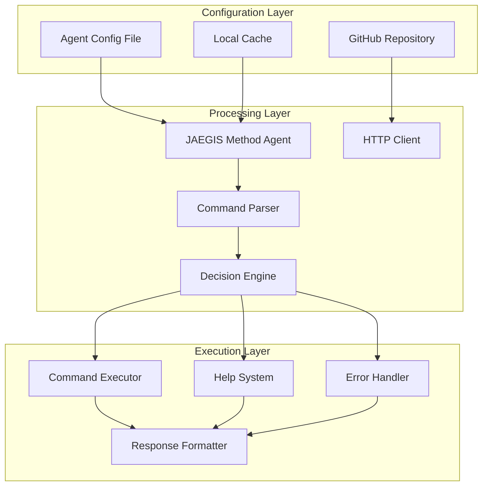

# JAEGIS - AI Agent Intelligence System
## Command Processing & GitHub Integration Framework

[](https://opensource.org/licenses/MIT)
[](https://nodejs.org/)
[](https://python.org/)
[]()

**JAEGIS** (AI Agent Intelligence System) is a sophisticated command processing framework that enables AI agents to dynamically fetch, process, and execute commands from GitHub repositories. Built with a hybrid Node.js and Python architecture for optimal performance and flexibility.

## 🌟 Key Features

- **🤖 Intelligent Command Processing** - Dynamic command interpretation and routing
- **🌐 GitHub Integration** - Real-time command fetching from GitHub repositories
- **⚡ Hybrid Architecture** - Node.js for performance, Python for AI/ML capabilities
- **🧠 Context-Aware Help System** - Intelligent help and documentation system
- **🔄 Smart Caching** - Intelligent caching with automatic updates
- **🛡️ Error Handling** - Comprehensive error handling with suggestions
- **📊 Real-time Monitoring** - System health and performance monitoring

## 🏗️ Architecture Overview



## 🚀 Quick Start

### Prerequisites

- **Node.js** 18+ 
- **Python** 3.8+
- **Git**

### Installation

```bash
# Clone the repository
git clone https://github.com/usemanusai/JAEGIS.git
cd JAEGIS

# Install Node.js dependencies
npm install

# Install Python dependencies
pip install -r requirements.txt

# Configure the system
cp config/config.example.json config/config.json
# Edit config.json with your settings
```

### Basic Usage

```bash
# Start the JAEGIS system
npm start

# Or use the CLI directly
node src/cli.js /help
```

## 📁 Project Structure

```
JAEGIS/
├── 📁 src/                     # Source code
│   ├── 📁 nodejs/              # Node.js components
│   ├── 📁 python/              # Python components
│   └── 📁 shared/              # Shared utilities
├── 📁 config/                  # Configuration files
├── 📁 commands/                # Command definitions
├── 📁 docs/                    # Documentation
├── 📁 tests/                   # Test suites
├── 📁 examples/                # Usage examples
├── 📁 scripts/                 # Build and deployment scripts
└── 📁 .github/                 # GitHub workflows
```

## 🎯 Core Components

### Command Processing Engine (Node.js)
High-performance command processing and routing system.

### GitHub Integration Module (Python)
Intelligent GitHub API integration with markdown parsing capabilities.

### Decision Engine
Smart routing logic that determines optimal processing paths.

### Help System
Dynamic help system with context-aware documentation.

## 📚 Documentation

- **[Installation Guide](docs/installation.md)** - Detailed setup instructions
- **[API Reference](docs/api.md)** - Complete API documentation
- **[Architecture Guide](docs/architecture.md)** - System architecture details
- **[Contributing](CONTRIBUTING.md)** - How to contribute to the project

## 🤝 Contributing

We welcome contributions! Please see our [Contributing Guide](CONTRIBUTING.md) for details.

## 📄 License

This project is licensed under the MIT License - see the [LICENSE](LICENSE) file for details.

## 🔗 Links

- **GitHub Repository**: https://github.com/usemanusai/JAEGIS
- **Documentation**: https://usemanusai.github.io/JAEGIS
- **Issues**: https://github.com/usemanusai/JAEGIS/issues

---

**Built with ❤️ by the JAEGIS Development Team**