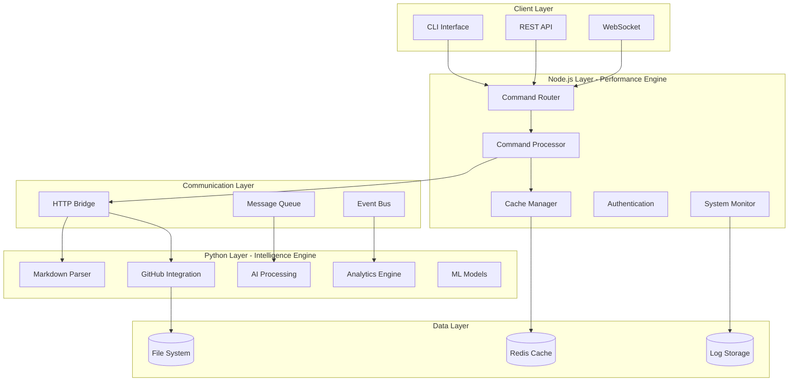

# JAEGIS Technology Stack Architecture
## Hybrid Node.js + Python Integration Framework

**Version:** 2.0.0  
**Last Updated:** January 25, 2025  
**Architecture Type:** Hybrid Microservices

---

## 🎯 Architecture Overview

JAEGIS employs a **hybrid architecture** that leverages the strengths of both Node.js and Python to create a high-performance, scalable command processing system with intelligent GitHub integration.

### Design Principles

1. **Performance First** - Node.js for high-throughput command processing
2. **Intelligence Focus** - Python for AI/ML capabilities and complex data processing
3. **Modular Design** - Loosely coupled components with clear interfaces
4. **Scalability** - Horizontal scaling capabilities for both technologies
5. **Maintainability** - Clear separation of concerns and well-defined APIs

---

## 🏗️ System Architecture



---

## 🚀 Node.js Components (Performance Layer)

### Core Responsibilities
- **High-speed command processing**
- **Real-time user interactions**
- **System orchestration**
- **API endpoints**
- **WebSocket connections**

### Technology Stack

```json
{
  "runtime": "Node.js 18+",
  "framework": "Express.js",
  "language": "JavaScript ES2023",
  "package_manager": "npm",
  "testing": "Jest",
  "linting": "ESLint",
  "formatting": "Prettier"
}
```

### Key Libraries

```javascript
// Core Dependencies
const express = require('express')           // Web framework
const ws = require('ws')                     // WebSocket support
const axios = require('axios')               // HTTP client
const commander = require('commander')       // CLI framework
const inquirer = require('inquirer')         // Interactive CLI

// Performance & Caching
const nodeCache = require('node-cache')      // In-memory caching
const redis = require('redis')               // Redis integration
const cluster = require('cluster')           // Multi-process scaling

// Utilities
const lodash = require('lodash')             // Utility functions
const chalk = require('chalk')               // Terminal colors
const ora = require('ora')                   // Loading spinners
const boxen = require('boxen')               // Terminal boxes
```

### Component Architecture

```
src/nodejs/
├── core/
│   ├── CommandRouter.js      # Main command routing logic
│   ├── CommandProcessor.js   # Command execution engine
│   ├── CacheManager.js       # Caching abstraction layer
│   └── ConfigManager.js      # Configuration management
├── api/
│   ├── routes/              # Express route handlers
│   ├── middleware/          # Custom middleware
│   └── controllers/         # API controllers
├── cli/
│   ├── commands/            # CLI command implementations
│   ├── prompts/             # Interactive prompts
│   └── utils/               # CLI utilities
├── services/
│   ├── PythonBridge.js      # Python integration service
│   ├── GitHubService.js     # GitHub API wrapper
│   └── MonitoringService.js # System monitoring
└── utils/
    ├── logger.js            # Logging utilities
    ├── validator.js         # Input validation
    └── helpers.js           # General helpers
```

---

## 🐍 Python Components (Intelligence Layer)

### Core Responsibilities
- **GitHub API integration**
- **Markdown processing**
- **AI/ML capabilities**
- **Complex data analysis**
- **Content intelligence**

### Technology Stack

```json
{
  "runtime": "Python 3.8+",
  "framework": "FastAPI",
  "language": "Python",
  "package_manager": "pip",
  "testing": "pytest",
  "linting": "flake8",
  "formatting": "black",
  "type_checking": "mypy"
}
```

### Key Libraries

```python
# Core Dependencies
import fastapi                    # Web framework
import requests                   # HTTP client
import asyncio                    # Async support
import aiohttp                    # Async HTTP client

# GitHub Integration
from github import Github         # GitHub API client
import markdown                   # Markdown processing
from bs4 import BeautifulSoup    # HTML parsing

# Data Processing
import pandas as pd               # Data analysis
import numpy as np                # Numerical computing
import json                       # JSON processing
import yaml                       # YAML processing

# Caching & Storage
import redis                      # Redis client
import diskcache                  # Disk-based caching
import sqlite3                    # Local database

# AI/ML (Optional)
# import openai                   # OpenAI integration
# import transformers             # Hugging Face models
# import langchain                # LangChain framework
```

### Component Architecture

```
src/python/
├── github/
│   ├── client.py            # GitHub API client
│   ├── parser.py            # Markdown parser
│   ├── cache.py             # GitHub content caching
│   └── webhook.py           # GitHub webhook handler
├── processing/
│   ├── markdown.py          # Markdown processing
│   ├── content.py           # Content analysis
│   ├── commands.py          # Command extraction
│   └── validation.py        # Content validation
├── ai/
│   ├── models.py            # AI model interfaces
│   ├── analysis.py          # Content analysis
│   └── suggestions.py       # Command suggestions
├── api/
│   ├── main.py              # FastAPI application
│   ├── routes/              # API route handlers
│   └── models/              # Pydantic models
└── utils/
    ├── logger.py            # Logging utilities
    ├── config.py            # Configuration management
    └── helpers.py           # General utilities
```

---

## 🔄 Inter-Process Communication

### Communication Patterns

1. **HTTP REST API** - Primary communication method
2. **Message Queues** - Asynchronous task processing
3. **Shared Cache** - Redis for shared state
4. **File System** - Shared configuration and logs
5. **WebSockets** - Real-time updates

### HTTP Bridge Architecture

```javascript
// Node.js to Python Communication
class PythonBridge {
  constructor(config) {
    this.baseUrl = config.python.api_url
    this.timeout = config.python.timeout
    this.client = axios.create({
      baseURL: this.baseUrl,
      timeout: this.timeout,
      headers: {
        'Content-Type': 'application/json',
        'X-Source': 'nodejs-bridge'
      }
    })
  }

  async fetchGitHubCommands(url) {
    const response = await this.client.post('/github/fetch', {
      url: url,
      cache: true
    })
    return response.data
  }

  async parseMarkdown(content) {
    const response = await this.client.post('/processing/parse', {
      content: content,
      format: 'commands'
    })
    return response.data
  }
}
```

```python
# Python API Endpoints
from fastapi import FastAPI, HTTPException
from pydantic import BaseModel

app = FastAPI(title="JAEGIS Python Intelligence API")

class GitHubFetchRequest(BaseModel):
    url: str
    cache: bool = True

@app.post("/github/fetch")
async def fetch_github_content(request: GitHubFetchRequest):
    """Fetch and process GitHub content."""
    try:
        client = GitHubClient()
        content = await client.fetch_content(request.url)
        
        if request.cache:
            await client.cache_content(request.url, content)
            
        return {
            "success": True,
            "data": content,
            "cached": request.cache
        }
    except Exception as e:
        raise HTTPException(status_code=500, detail=str(e))
```

---

## 📊 Performance Optimization

### Node.js Optimizations

1. **Cluster Mode** - Multi-process scaling
2. **Connection Pooling** - HTTP connection reuse
3. **Memory Caching** - In-memory command cache
4. **Async/Await** - Non-blocking operations
5. **Stream Processing** - Large data handling

```javascript
// Cluster Configuration
const cluster = require('cluster')
const numCPUs = require('os').cpus().length

if (cluster.isMaster) {
  console.log(`Master ${process.pid} is running`)
  
  // Fork workers
  for (let i = 0; i < numCPUs; i++) {
    cluster.fork()
  }
  
  cluster.on('exit', (worker, code, signal) => {
    console.log(`Worker ${worker.process.pid} died`)
    cluster.fork()
  })
} else {
  // Worker process
  require('./app.js')
  console.log(`Worker ${process.pid} started`)
}
```

### Python Optimizations

1. **Async Processing** - AsyncIO for I/O operations
2. **Connection Pooling** - HTTP session reuse
3. **Caching Layers** - Multi-level caching
4. **Batch Processing** - Bulk operations
5. **Memory Management** - Efficient data structures

```python
# Async GitHub Client
import aiohttp
import asyncio
from typing import List, Dict

class AsyncGitHubClient:
    def __init__(self):
        self.session = None
        
    async def __aenter__(self):
        self.session = aiohttp.ClientSession()
        return self
        
    async def __aexit__(self, exc_type, exc_val, exc_tb):
        await self.session.close()
        
    async def fetch_multiple(self, urls: List[str]) -> List[Dict]:
        """Fetch multiple URLs concurrently."""
        tasks = [self.fetch_single(url) for url in urls]
        results = await asyncio.gather(*tasks)
        return results
        
    async def fetch_single(self, url: str) -> Dict:
        """Fetch single URL with error handling."""
        try:
            async with self.session.get(url) as response:
                content = await response.text()
                return {
                    "url": url,
                    "content": content,
                    "status": response.status
                }
        except Exception as e:
            return {
                "url": url,
                "error": str(e),
                "status": 500
            }
```

---

## 🔧 Development Workflow

### Local Development Setup

```bash
# 1. Clone repository
git clone https://github.com/usemanusai/JAEGIS.git
cd JAEGIS

# 2. Setup Node.js environment
npm install
cp config/config.example.json config/config.json

# 3. Setup Python environment
python -m venv venv
source venv/bin/activate  # On Windows: venv\Scripts\activate
pip install -r requirements.txt

# 4. Start development servers
npm run dev          # Node.js server (port 3000)
python src/python/api/main.py  # Python API (port 5000)

# 5. Run tests
npm test            # Node.js tests
pytest              # Python tests
```

### Build Process

```bash
# Production build
npm run build       # Build Node.js components
python -m build     # Build Python packages

# Docker build
docker-compose build
docker-compose up -d
```

---

## 🚀 Deployment Architecture

### Container Strategy

```yaml
# docker-compose.yml
version: '3.8'
services:
  jaegis-nodejs:
    build: 
      context: .
      dockerfile: Dockerfile.nodejs
    ports:
      - "3000:3000"
    environment:
      - NODE_ENV=production
      - PYTHON_API_URL=http://jaegis-python:5000
    depends_on:
      - redis
      - jaegis-python

  jaegis-python:
    build:
      context: .
      dockerfile: Dockerfile.python
    ports:
      - "5000:5000"
    environment:
      - PYTHON_ENV=production
      - REDIS_URL=redis://redis:6379
    depends_on:
      - redis

  redis:
    image: redis:7-alpine
    ports:
      - "6379:6379"
    volumes:
      - redis_data:/data

volumes:
  redis_data:
```

### Scaling Strategy

1. **Horizontal Scaling** - Multiple container instances
2. **Load Balancing** - NGINX or cloud load balancers
3. **Auto-scaling** - Kubernetes HPA or cloud auto-scaling
4. **Database Scaling** - Redis clustering
5. **CDN Integration** - Static asset delivery

---

## 📈 Monitoring & Observability

### Metrics Collection

```javascript
// Node.js Monitoring
const prometheus = require('prom-client')

const httpRequestDuration = new prometheus.Histogram({
  name: 'http_request_duration_seconds',
  help: 'Duration of HTTP requests in seconds',
  labelNames: ['method', 'route', 'status']
})

const commandProcessingTime = new prometheus.Histogram({
  name: 'command_processing_duration_seconds',
  help: 'Duration of command processing in seconds',
  labelNames: ['command', 'success']
})
```

```python
# Python Monitoring
from prometheus_client import Counter, Histogram, generate_latest

github_requests = Counter(
    'github_requests_total',
    'Total GitHub API requests',
    ['endpoint', 'status']
)

content_processing_time = Histogram(
    'content_processing_duration_seconds',
    'Time spent processing content',
    ['content_type']
)
```

### Health Checks

```javascript
// Node.js Health Check
app.get('/health', async (req, res) => {
  const health = {
    status: 'healthy',
    timestamp: new Date().toISOString(),
    services: {
      python_api: await checkPythonAPI(),
      redis: await checkRedis(),
      github: await checkGitHub()
    }
  }
  
  const isHealthy = Object.values(health.services)
    .every(service => service.status === 'healthy')
    
  res.status(isHealthy ? 200 : 503).json(health)
})
```

---

## 🔒 Security Considerations

### Authentication & Authorization

1. **API Key Management** - Secure GitHub token storage
2. **Input Validation** - Comprehensive input sanitization
3. **Rate Limiting** - API and command rate limits
4. **CORS Configuration** - Proper cross-origin settings
5. **Encryption** - Data encryption at rest and in transit

### Security Implementation

```javascript
// Security Middleware
const helmet = require('helmet')
const rateLimit = require('express-rate-limit')

app.use(helmet())
app.use(rateLimit({
  windowMs: 15 * 60 * 1000, // 15 minutes
  max: 100 // limit each IP to 100 requests per windowMs
}))

// Input validation
const joi = require('joi')

const commandSchema = joi.object({
  command: joi.string().max(1000).required(),
  parameters: joi.object().optional()
})
```

---

## 🔮 Future Enhancements

### Planned Improvements

1. **GraphQL API** - More flexible data querying
2. **gRPC Communication** - High-performance RPC
3. **Event Sourcing** - Complete audit trail
4. **Machine Learning** - Intelligent command suggestions
5. **Microservices** - Further service decomposition

### Technology Roadmap

- **Q1 2025**: Enhanced caching and performance optimization
- **Q2 2025**: AI/ML integration for intelligent features
- **Q3 2025**: Microservices architecture migration
- **Q4 2025**: Advanced analytics and reporting

---

**This hybrid architecture provides the foundation for a scalable, maintainable, and high-performance command processing system that leverages the best of both Node.js and Python ecosystems.**