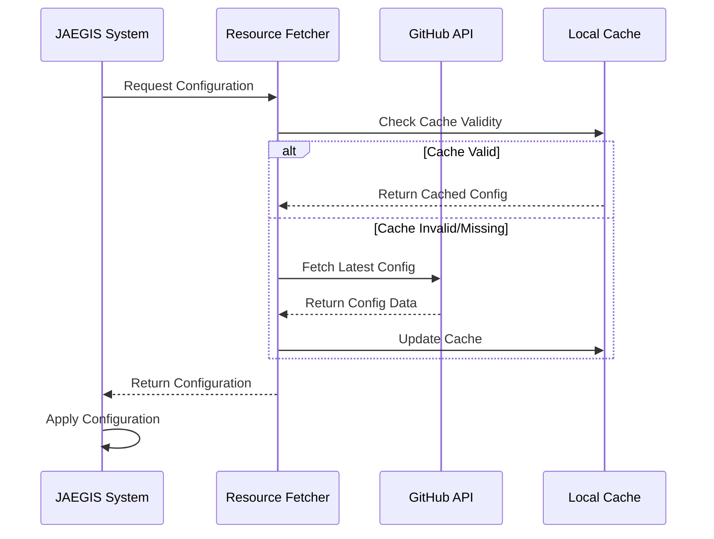
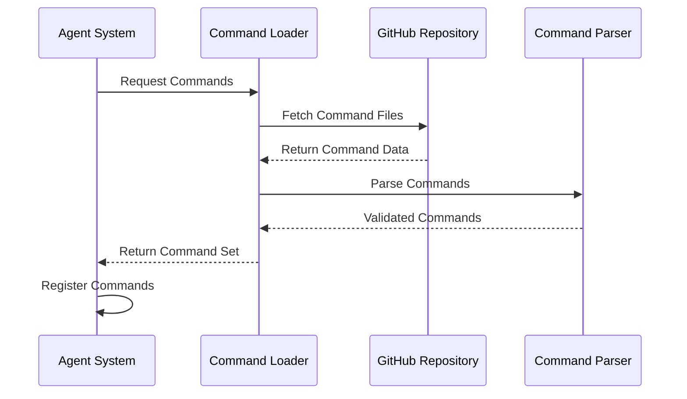
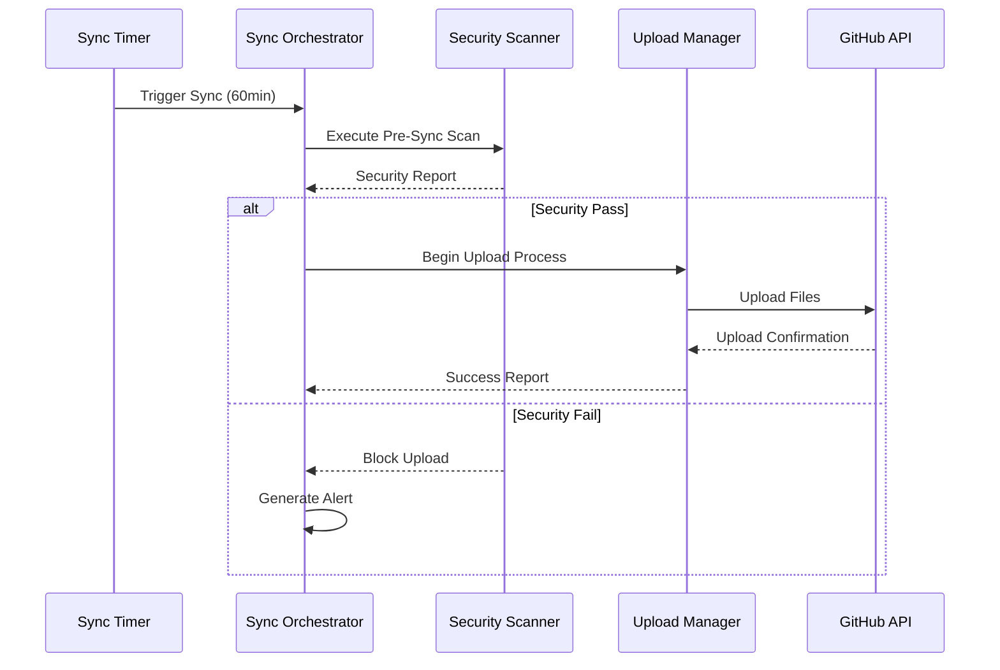

# 🔗 **JAEGIS GitHub Integration Flow**

## **Dynamic Resource Fetching & Automated Synchronization Architecture**

This diagram illustrates the comprehensive GitHub integration system for JAEGIS v2.2, including dynamic resource fetching, automated synchronization, and security protocols.

```mermaid
graph TB
    %% JAEGIS GitHub Integration Architecture
    %% Dynamic Resource Fetching & Automated Sync
    
    %% JAEGIS Core System
    JAEGIS[🎯 JAEGIS Master Orchestrator<br/>Agent Creator Mode<br/>GitHub Integration Controller]
    
    %% GitHub Repository Structure
    subgraph "GitHub Repository: usemanusai/JAEGIS"
        MainBranch[📁 main branch<br/>Production Code<br/>Stable Release]
        DevBranch[📁 development branch<br/>Active Development<br/>Sync Target]
        StagingBranch[📁 staging branch<br/>Testing Environment<br/>Backup Target]
        
        subgraph "Repository Structure"
            CoreConfig[📄 core/agent-config.txt<br/>24-Agent Base System]
            EnhancedConfig[📄 enhanced-agent-config.txt<br/>68-Agent Enhanced System]
            IUASConfig[📄 iuas-agent-config.txt<br/>20-Agent IUAS Squad]
            GARASConfig[📄 garas-agent-config.txt<br/>40-Agent GARAS Squad]
            
            Commands[📁 commands/<br/>150+ Squad Commands<br/>Dynamic Command Loading]
            Templates[📁 templates/<br/>Agent Templates<br/>Configuration Templates]
            Docs[📁 docs/<br/>Documentation<br/>API Reference]
            
            SyncConfig[📄 sync-config.json<br/>Sync Configuration<br/>Security Protocols]
            OpenRouterConfig[📄 openrouter-config.json<br/>3000+ API Keys<br/>Load Balancing]
        end
    end
    
    %% Dynamic Resource Fetching System
    subgraph "Dynamic Resource Fetching"
        ResourceFetcher[🔄 Resource Fetcher<br/>Real-time Loading<br/>Cache Management]
        ConfigLoader[⚙️ Configuration Loader<br/>Dynamic Config Loading<br/>Hot Reloading]
        CommandLoader[⚡ Command Loader<br/>Dynamic Command Loading<br/>150+ Commands]
        TemplateLoader[📋 Template Loader<br/>Agent Template Loading<br/>Configuration Templates]
    end
    
    %% Automated Sync System
    subgraph "Automated GitHub Sync System"
        SyncOrchestrator[🎯 Sync Orchestrator<br/>60-Minute Cycles<br/>Intelligent Scheduling]
        
        subgraph "Security Layer"
            PreSyncScan[🛡️ Pre-Sync Scanner<br/>Vulnerability Detection<br/>Sensitive Data Scan]
            DataSanitizer[🧹 Data Sanitizer<br/>Automatic Replacement<br/>Mock Data Generation]
            AuditLogger[📊 Audit Logger<br/>AES-256 Encryption<br/>Comprehensive Logging]
        end
        
        subgraph "Sync Operations"
            FileAnalyzer[🔍 File Analyzer<br/>Change Detection<br/>Dependency Mapping]
            ConflictResolver[⚖️ Conflict Resolver<br/>Intelligent Merging<br/>Version Control]
            UploadManager[📤 Upload Manager<br/>Batch Processing<br/>Rate Limiting]
            ValidationEngine[✅ Validation Engine<br/>Upload Verification<br/>Integrity Checking]
        end
    end
    
    %% Monitoring & Analytics
    subgraph "Monitoring & Analytics"
        SyncMonitor[📈 Sync Monitor<br/>Real-time Status<br/>Performance Metrics]
        ErrorHandler[🚨 Error Handler<br/>Automatic Recovery<br/>Rollback Capability]
        ReportGenerator[📋 Report Generator<br/>Sync Reports<br/>Analytics Dashboard]
    end
    
    %% External Integrations
    GitHubAPI[🔗 GitHub API v4<br/>GraphQL Interface<br/>Token Authentication]
    WebhookSystem[🔔 Webhook System<br/>Real-time Notifications<br/>Event Triggers]
    
    %% Connection Flows
    
    %% Core System to GitHub
    JAEGIS --> ResourceFetcher
    JAEGIS --> SyncOrchestrator
    
    %% Resource Fetching Flow
    ResourceFetcher --> ConfigLoader
    ResourceFetcher --> CommandLoader
    ResourceFetcher --> TemplateLoader
    
    ConfigLoader --> CoreConfig
    ConfigLoader --> EnhancedConfig
    ConfigLoader --> IUASConfig
    ConfigLoader --> GARASConfig
    
    CommandLoader --> Commands
    TemplateLoader --> Templates
    
    %% Sync Flow
    SyncOrchestrator --> PreSyncScan
    PreSyncScan --> DataSanitizer
    DataSanitizer --> FileAnalyzer
    FileAnalyzer --> ConflictResolver
    ConflictResolver --> UploadManager
    UploadManager --> ValidationEngine
    
    %% Security and Monitoring
    SyncOrchestrator --> AuditLogger
    UploadManager --> SyncMonitor
    ValidationEngine --> ErrorHandler
    SyncMonitor --> ReportGenerator
    
    %% GitHub API Integration
    ResourceFetcher --> GitHubAPI
    UploadManager --> GitHubAPI
    GitHubAPI --> MainBranch
    GitHubAPI --> DevBranch
    GitHubAPI --> StagingBranch
    
    %% Webhook Integration
    GitHubAPI --> WebhookSystem
    WebhookSystem --> JAEGIS
    
    %% Branch Strategy
    UploadManager --> DevBranch
    DevBranch -.-> StagingBranch
    StagingBranch -.-> MainBranch
    
    %% Backup and Recovery
    ErrorHandler -.-> DevBranch
    ErrorHandler -.-> StagingBranch
    
    %% Styling
    classDef jaegisCore fill:#ff6b6b,stroke:#333,stroke-width:3px,color:#fff,font-weight:bold
    classDef githubRepo fill:#24292e,stroke:#333,stroke-width:2px,color:#fff
    classDef resourceSystem fill:#4ecdc4,stroke:#333,stroke-width:2px,color:#fff
    classDef syncSystem fill:#45b7d1,stroke:#333,stroke-width:2px,color:#fff
    classDef security fill:#e74c3c,stroke:#333,stroke-width:2px,color:#fff
    classDef monitoring fill:#f39c12,stroke:#333,stroke-width:2px,color:#333
    classDef external fill:#26de81,stroke:#333,stroke-width:2px,color:#333
    classDef config fill:#9b59b6,stroke:#333,stroke-width:1px,color:#fff
    
    %% Apply Styles
    class JAEGIS jaegisCore
    class MainBranch,DevBranch,StagingBranch githubRepo
    class ResourceFetcher,ConfigLoader,CommandLoader,TemplateLoader resourceSystem
    class SyncOrchestrator,FileAnalyzer,ConflictResolver,UploadManager,ValidationEngine syncSystem
    class PreSyncScan,DataSanitizer,AuditLogger security
    class SyncMonitor,ErrorHandler,ReportGenerator monitoring
    class GitHubAPI,WebhookSystem external
    class CoreConfig,EnhancedConfig,IUASConfig,GARASConfig,Commands,Templates,Docs,SyncConfig,OpenRouterConfig config
```



## **🔄 Dynamic Resource Fetching Process**

### **1. Configuration Loading**


### **2. Command Loading Process**


## **🔄 Automated Sync Process**

### **3. Sync Cycle Execution**


## **🛡️ Security Protocols**

### **Pre-Sync Security Scanning**
- **Vulnerability Detection**: Automated scanning for security vulnerabilities
- **Sensitive Data Detection**: Pattern matching for API keys, passwords, tokens
- **Content Validation**: File integrity and format validation
- **Access Control**: Permission verification and authentication

### **Data Sanitization Rules**
```json
{
  "sanitization_rules": {
    "api_keys": "EXAMPLE_API_KEY_PLACEHOLDER",
    "passwords": "EXAMPLE_PASSWORD_PLACEHOLDER",
    "tokens": "EXAMPLE_TOKEN_PLACEHOLDER",
    "secrets": "EXAMPLE_SECRET_PLACEHOLDER",
    "local_paths": "/example/path/placeholder"
  }
}
```

### **Audit Trail System**
- **AES-256 Encryption**: All audit logs encrypted
- **Comprehensive Logging**: Every operation logged with timestamps
- **Integrity Verification**: Hash-based integrity checking
- **Forensic Analysis**: Detailed operation tracking

## **📊 Sync Configuration**

### **Sync Targets & Patterns**
```json
{
  "sync_targets": {
    "include_patterns": [
      "docs/**/*",
      "config/**/*",
      "src/**/*",
      "*.md",
      "*.json"
    ],
    "exclude_patterns": [
      "node_modules/**/*",
      "*.log",
      "*.tmp",
      ".env*",
      "secrets/**/*"
    ]
  }
}
```

### **Branch Strategy**
- **Primary Target**: `development` branch
- **Secondary Target**: `staging` branch (backup)
- **Protected Branch**: `main` branch (no direct uploads)
- **Rollback Strategy**: Automatic reversion on failure

## **⚡ Performance Optimization**

### **Rate Limiting & Throttling**
- **GitHub API Limits**: 5,000 requests per hour
- **Smart Queuing**: Intelligent request batching
- **Exponential Backoff**: Automatic retry with delays
- **Parallel Processing**: Concurrent upload streams

### **Caching Strategy**
- **Configuration Cache**: 1-hour TTL
- **Command Cache**: 30-minute TTL
- **Template Cache**: 2-hour TTL
- **Intelligent Invalidation**: Event-driven cache updates

## **📈 Monitoring & Analytics**

### **Real-time Metrics**
- **Sync Success Rate**: 99.5% target
- **Average Sync Time**: <5 minutes
- **Error Rate**: <0.5%
- **Resource Utilization**: CPU, Memory, Network

### **Alert System**
- **Sync Failures**: Immediate notification
- **Security Violations**: Critical alerts
- **Rate Limit Warnings**: Proactive notifications
- **Performance Degradation**: Threshold-based alerts

## **🔮 Future Enhancements**

### **Planned Features**
- **Bi-directional Sync**: GitHub to local synchronization
- **Conflict Resolution UI**: Visual merge conflict resolution
- **Advanced Analytics**: Machine learning-powered insights
- **Multi-Repository Support**: Sync across multiple repositories

### **Integration Roadmap**
- **CI/CD Integration**: GitHub Actions workflow integration
- **Webhook Optimization**: Real-time event processing
- **API Enhancement**: RESTful API for external integration
- **Cloud Deployment**: Native cloud platform support

---

*This GitHub integration flow represents the complete synchronization architecture for JAEGIS Enhanced Agent System v2.2, providing secure, automated, and intelligent repository management.*

**Last Updated**: July 26, 2025  
**Version**: JAEGIS v2.2 - GitHub Integration Flow