# 🏗️ **JAEGIS Master System Architecture**

## **Complete 6-Tier, 128-Agent System Overview**

This diagram represents the complete JAEGIS Enhanced Agent System v2.2 architecture with all 128 agents organized across 6 hierarchical tiers.

```mermaid
graph TB
    %% JAEGIS v2.2 Complete System Architecture
    %% 6-Tier, 128-Agent System
    
    %% Tier 1: Master Orchestrator (1 agent)
    JAEGIS[🎯 JAEGIS Master Orchestrator<br/>Agent Creator Mode<br/>System Intelligence Core]
    
    %% Tier 2: Primary Leadership (3 agents)
    John[👔 John - Product Manager<br/>Strategic Planning<br/>Stakeholder Management]
    Fred[🏗️ Fred - System Architect<br/>Technical Leadership<br/>Architecture Design]
    Tyler[⚡ Tyler - Task Specialist<br/>Execution Coordination<br/>Performance Optimization]
    
    %% Tier 3: Core Squads (48 agents - 6 squads × 8 agents)
    DevSquad[💻 Development Squad<br/>8 Agents<br/>Full-Stack Development]
    QualitySquad[🔍 Quality Squad<br/>8 Agents<br/>Testing & QA]
    BusinessSquad[📊 Business Squad<br/>8 Agents<br/>Analysis & Strategy]
    ProcessSquad[⚙️ Process Squad<br/>8 Agents<br/>Project Management]
    ContentSquad[📝 Content Squad<br/>8 Agents<br/>Documentation & Content]
    SystemSquad[🖥️ System Squad<br/>8 Agents<br/>Infrastructure & DevOps]
    
    %% Tier 4: Specialized Squads (16 agents - 4 squads × 4 agents)
    TaskMgmtSquad[📋 Task Management Squad<br/>4 Agents<br/>Workflow Orchestration]
    AgentBuilderSquad[🔧 Agent Builder Squad<br/>4 Agents<br/>Agent Creation & Validation]
    CoherenceSquad[🔗 System Coherence Squad<br/>4 Agents<br/>Integration Management]
    TemporalSquad[⏰ Temporal Intelligence Squad<br/>4 Agents<br/>Time-Aware Operations]
    
    %% Tier 5: Conditional Squads (4 agents - 4 squads × 1 agent)
    SecuritySquad[🛡️ Security Squad<br/>1 Agent<br/>Security Protocols]
    ComplianceSquad[📋 Compliance Squad<br/>1 Agent<br/>Regulatory Compliance]
    AuditSquad[🔍 Audit Squad<br/>1 Agent<br/>System Auditing]
    BackupSquad[💾 Backup Squad<br/>1 Agent<br/>Data Protection]
    
    %% Tier 6: Maintenance Squads (60 agents - 2 squads: 20 + 40)
    IUAS[🔧 IUAS Squad<br/>20 Agents<br/>Internal Updates & Maintenance]
    GARAS[🎯 GARAS Squad<br/>40 Agents<br/>Gap Analysis & Resolution]
    
    %% Primary Connections - Tier 1 to Tier 2
    JAEGIS --> John
    JAEGIS --> Fred
    JAEGIS --> Tyler
    
    %% Leadership to Core Squads - Tier 2 to Tier 3
    John --> DevSquad
    John --> BusinessSquad
    Fred --> QualitySquad
    Fred --> SystemSquad
    Tyler --> ProcessSquad
    Tyler --> ContentSquad
    
    %% Core to Specialized - Tier 3 to Tier 4
    DevSquad --> AgentBuilderSquad
    QualitySquad --> CoherenceSquad
    ProcessSquad --> TaskMgmtSquad
    SystemSquad --> TemporalSquad
    
    %% Specialized to Conditional - Tier 4 to Tier 5
    AgentBuilderSquad --> SecuritySquad
    CoherenceSquad --> ComplianceSquad
    TaskMgmtSquad --> AuditSquad
    TemporalSquad --> BackupSquad
    
    %% Master to Maintenance - Tier 1 to Tier 6
    JAEGIS --> IUAS
    JAEGIS --> GARAS
    
    %% Cross-Squad Collaboration Lines
    DevSquad -.-> QualitySquad
    BusinessSquad -.-> ProcessSquad
    ContentSquad -.-> SystemSquad
    IUAS -.-> GARAS
    
    %% A.M.A.S.I.A.P. Protocol Integration
    AMASIAP[🧠 A.M.A.S.I.A.P. Protocol<br/>Automatic Input Enhancement<br/>Research Framework]
    JAEGIS --> AMASIAP
    AMASIAP -.-> GARAS
    
    %% External Integrations
    GitHub[🔗 GitHub Integration<br/>Dynamic Resource Fetching<br/>Automated Sync]
    OpenRouter[🤖 OpenRouter.ai<br/>3000+ API Keys<br/>Load Balancing]
    
    JAEGIS --> GitHub
    JAEGIS --> OpenRouter
    
    %% Styling
    classDef master fill:#ff6b6b,stroke:#333,stroke-width:4px,color:#fff,font-weight:bold
    classDef leadership fill:#4ecdc4,stroke:#333,stroke-width:3px,color:#fff,font-weight:bold
    classDef coreSquad fill:#45b7d1,stroke:#333,stroke-width:2px,color:#fff
    classDef specializedSquad fill:#96ceb4,stroke:#333,stroke-width:2px,color:#333
    classDef conditionalSquad fill:#feca57,stroke:#333,stroke-width:2px,color:#333
    classDef maintenanceSquad fill:#ff9ff3,stroke:#333,stroke-width:3px,color:#333,font-weight:bold
    classDef protocol fill:#a55eea,stroke:#333,stroke-width:2px,color:#fff
    classDef integration fill:#26de81,stroke:#333,stroke-width:2px,color:#333
    
    %% Apply Styles
    class JAEGIS master
    class John,Fred,Tyler leadership
    class DevSquad,QualitySquad,BusinessSquad,ProcessSquad,ContentSquad,SystemSquad coreSquad
    class TaskMgmtSquad,AgentBuilderSquad,CoherenceSquad,TemporalSquad specializedSquad
    class SecuritySquad,ComplianceSquad,AuditSquad,BackupSquad conditionalSquad
    class IUAS,GARAS maintenanceSquad
    class AMASIAP protocol
    class GitHub,OpenRouter integration
```

## **📊 System Statistics**

### **Agent Distribution by Tier**
- **Tier 1**: 1 agent (Master Orchestrator)
- **Tier 2**: 3 agents (Primary Leadership)
- **Tier 3**: 48 agents (Core Squads - 6 × 8)
- **Tier 4**: 16 agents (Specialized Squads - 4 × 4)
- **Tier 5**: 4 agents (Conditional Squads - 4 × 1)
- **Tier 6**: 60 agents (Maintenance Squads - 20 + 40)

**Total: 128 Agents**

### **Squad Breakdown**
- **Core Squads**: 6 squads (48 agents)
- **Specialized Squads**: 4 squads (16 agents)
- **Conditional Squads**: 4 squads (4 agents)
- **Maintenance Squads**: 2 squads (60 agents)

**Total: 16 Squads**

## **🔄 Communication Flows**

### **Hierarchical Command Flow**
1. **JAEGIS Master** → **Primary Leadership** → **Core Squads**
2. **Core Squads** → **Specialized Squads** → **Conditional Squads**
3. **JAEGIS Master** → **Maintenance Squads** (Direct)

### **Cross-Squad Collaboration**
- **Development ↔ Quality**: Code review and testing coordination
- **Business ↔ Process**: Strategic planning and execution alignment
- **Content ↔ System**: Documentation and infrastructure coordination
- **IUAS ↔ GARAS**: Maintenance and gap resolution collaboration

### **Protocol Integration**
- **A.M.A.S.I.A.P.** enhances all inputs and coordinates with GARAS
- **GitHub Integration** provides dynamic resource fetching
- **OpenRouter.ai** manages AI model access and load balancing

## **⚡ Operational Modes**

### **Mode 5: Agent Creator Mode (Current)**
- **All 128 agents active**
- **Complete 6-tier architecture**
- **Full squad coordination**
- **Maximum system capability**

### **Mode 3: Enhanced Development**
- **68 agents active**
- **Tiers 1-4 operational**
- **Core and specialized squads**
- **Advanced development capability**

### **Mode 2: Standard Development**
- **24 agents active**
- **Tiers 1-3 operational**
- **Core squads only**
- **Standard development capability**

## **🛡️ Security & Protection**

### **Infrastructure Protection**
- **Lock/Unlock Commands**: `/jaegis-lock-infrastructure`
- **Security Scanning**: Automated vulnerability detection
- **Audit Trails**: Comprehensive logging with AES-256 encryption
- **Access Control**: Role-based permissions and authentication

### **Data Protection**
- **Backup Squad**: Automated data protection and recovery
- **Compliance Squad**: Regulatory compliance monitoring
- **Security Squad**: Real-time security protocol enforcement

## **📈 Performance Optimization**

### **Load Balancing**
- **OpenRouter.ai**: 3000+ API keys with intelligent distribution
- **Squad Coordination**: Optimized task distribution
- **Resource Management**: Dynamic resource allocation

### **Monitoring & Analytics**
- **Real-time Metrics**: System performance monitoring
- **Agent Analytics**: Individual agent performance tracking
- **Squad Metrics**: Team performance optimization

## **🔗 Integration Points**

### **GitHub Integration**
- **Dynamic Resource Fetching**: Real-time configuration loading
- **Automated Sync**: 60-minute synchronization cycles
- **Version Control**: Comprehensive change tracking

### **OpenRouter.ai Integration**
- **Multi-Model Support**: Access to 50+ AI models
- **Intelligent Routing**: Performance-based model selection
- **Failover Mechanisms**: Automatic backup provider switching

## **🚀 Future Expansion**

### **Scalability Design**
- **Modular Architecture**: Easy addition of new squads and agents
- **Horizontal Scaling**: Support for distributed deployment
- **Cloud Integration**: Native cloud platform support

### **Enhancement Opportunities**
- **Additional Specialized Squads**: Domain-specific capabilities
- **Advanced AI Integration**: Next-generation model support
- **Enterprise Features**: Advanced enterprise functionality

---

*This architecture represents the complete JAEGIS Enhanced Agent System v2.2 with 128 agents across 6 tiers, providing enterprise-grade AI agent orchestration capabilities.*

**Last Updated**: July 26, 2025  
**Version**: JAEGIS v2.2 - Phase 5 Complete